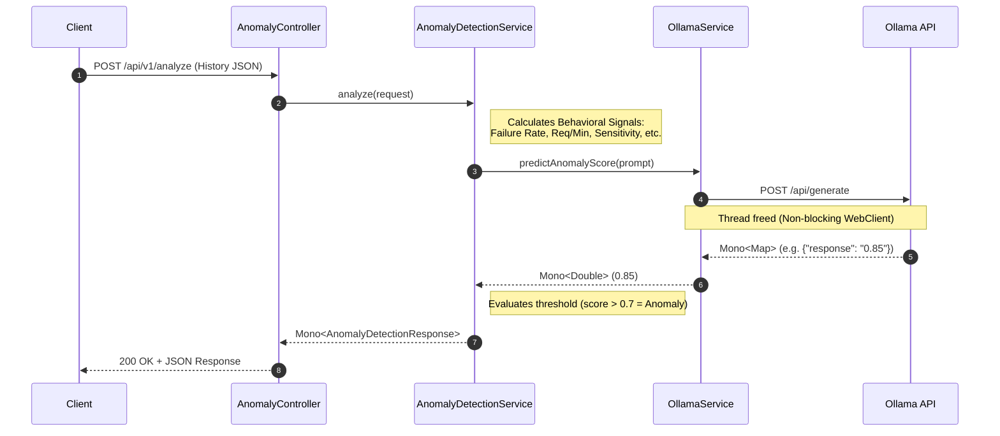

# SentientGate AI Service

The **AI Service** is a reactive microservice within the SentientGate ecosystem that utilizes AI behavioral models (powered by Ollama) to detect anomalies in HTTP request patterns. Built specifically to handle high concurrency and scale effortlessly, this service utilizes **Spring WebFlux** to ensure completely non-blocking IO during inference.

## 🚀 Technology Stack
* **Java 21**
* **Spring Boot 3.5.x**
* **Spring WebFlux** (Project Reactor & Netty)
* **Spring Cloud Netflix Eureka** (Service Discovery)
* **Ollama backend** (Local/Remote AI inference)

## 🏗 Architecture & Flow

The AI Service leverages a non-blocking asynchronous pipeline to maximize throughput. Instead of tying up threads while waiting for the AI model to generate a score, the service uses `Mono` streams that seamlessly yield execution back to the server.



## 🔌 API Reference

### Analyze Behavioral Patterns
**Endpoint**: `POST /api/v1/analyze`

**Request Body** (`AnomalyDetectionRequest`):
```json
{
  "history": [
    {
      "uuid": "req-1234",
      "path": "/admin/config",
      "method": "POST",
      "clientIp": "192.168.1.5",
      "statusCode": 403,
      "timestamp": 1714500000000
    }
  ]
}
```

**Response Body** (`AnomalyDetectionResponse`):
```json
{
  "anomaly": true,
  "confidence": 0.85,
  "modelVersion": "v1.0",
  "inferenceTimeMs": 145,
  "isAnomaly": true,
  "confidenceScore": 0.85,
  "patternDetected": "AI_BEHAVIORAL_ANOMALY",
  "suggestedBlockMinutes": 60
}
```

## ⚙️ Configuration

Application settings are managed in `src/main/resources/application.yml`:

| Environment Variable | YAML Key | Description | Default Value |
| :--- | :--- | :--- | :--- |
| `OLLAMA_BASE_URL` | `ollama.base-url` | The HTTP endpoint for the Ollama inference engine. | `http://localhost:11434` |
| `OLLAMA_MODEL` | `ollama.model` | The specific model string to execute against. | `gemma3.2:latest` |
| `EUREKA_SERVER_URL` | `eureka.client.service-url.defaultZone` | Eureka Service Registry endpoint. | `http://localhost:8761/eureka` |
| `SERVER_PORT` | `server.port` | The port the service binds to. | `8082` |

> [!WARNING]
> While `server.servlet.context-path` is defined in the configuration, **Spring WebFlux does not utilize servlets**. If you require a global URL prefix in production, utilize a gateway route or replace it with `spring.webflux.base-path: /ai-service`.

## 🛠 Running Locally

1. **Start Ollama** (and ensure your required model is pulled):
   ```bash
   ollama serve
   ollama pull gemma3.2:latest
   ```

2. **Start the AI Service**:
   ```bash
   ./mvnw clean spring-boot:run
   ```

3. **Run Tests**:
   The service uses reactive test suites (`StepVerifier` and `WebTestClient`) to validate edge cases heavily.
   ```bash
   ./mvnw clean test
   ```
