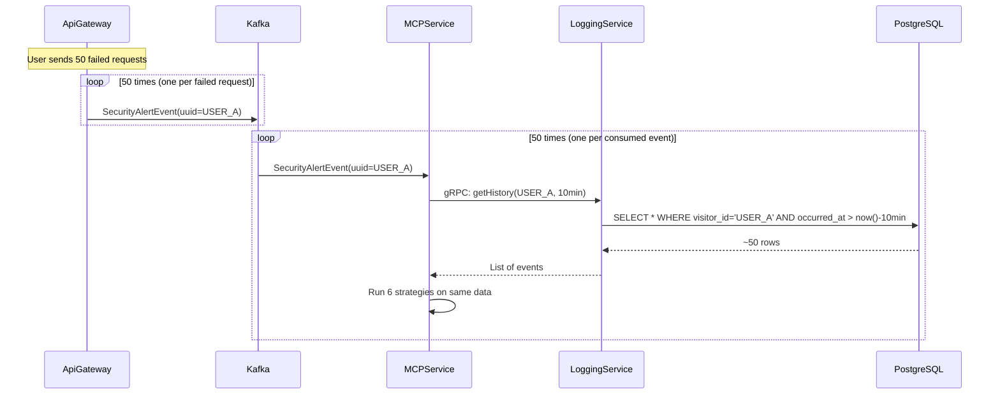
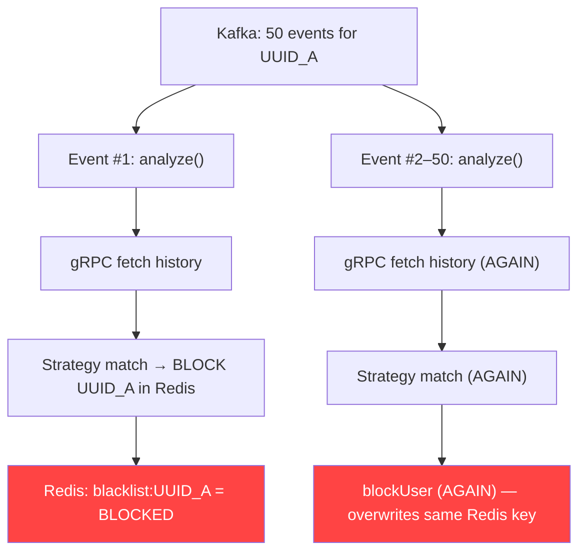
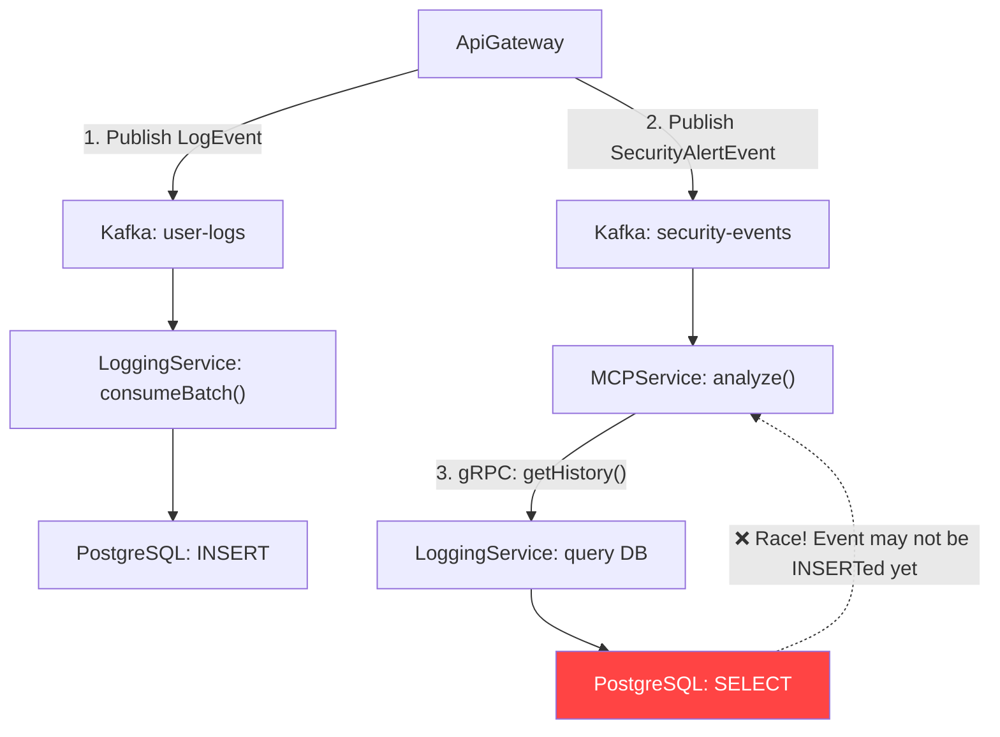
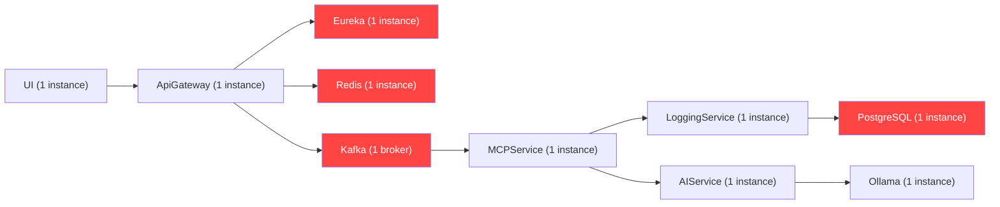

# 🏗️ SentientGate — Architectural Design Flaws

> System-level data flow and pipeline design problems that cause overhead, redundancy, and failure under load.
> Date: 2026-03-25

---

## Flaw 1: Redundant DB Fetches for the Same User Under Attack

### What Happens

When a user sends 50 failed requests in 10 minutes, the system produces **50 SecurityAlertEvents** to Kafka. The MCPService consumes each one individually and for **each event**, makes a separate gRPC call to LoggingService, which queries PostgreSQL for the same user's 10-minute history.



### Impact

| What | Cost |
|------|------|
| PostgreSQL queries | **50 identical queries** returning the same ~50 rows |
| gRPC round-trips | **50 network calls** for the same data |
| Strategy evaluation | **50 × 6 = 300** strategy executions on identical data |
| Time wasted | If each gRPC + DB round-trip takes 20ms → **1 full second** burned on redundant work |

### Root Cause

No **in-memory cache** in MCPService for recently-fetched behavioral history. Every `analyze()` call blindly re-fetches from DB.

### Fix

Add a **TTL-based local cache** (e.g., Caffeine) in `EventHistoryService`:

```java
// Cache user history for 30 seconds — covers burst of events from same user
private final Cache<String, List<UserLogEvent>> historyCache = Caffeine.newBuilder()
    .expireAfterWrite(Duration.ofSeconds(30))
    .maximumSize(10_000)
    .build();

public List<UserLogEvent> getAllEventsInDuration(String uuid, int duration) {
    return historyCache.get(uuid, key -> fetchFromGrpc(key, duration));
}
```

---

## Flaw 2: Already-Blocked Users Still Get Fully Analyzed

### What Happens

After `EnforcementService.blockUser()` writes `blacklist:UUID` to Redis, the **remaining Kafka events for that same UUID** are still consumed and fully analyzed — including gRPC fetch + strategy evaluation + possibly AI inference call.



### Impact

49 out of 50 analyses are **completely wasteful**. Under a real DDoS attack with thousands of events, this creates a self-inflicted DoS on your own infrastructure.

### Fix

Add a **Redis check at the start** of `McpAnalysisService.analyze()`:

```java
public void analyze(SecurityAlertEvent alert) {
    // Skip if already blocked
    Boolean alreadyBlocked = redisTemplate.hasKey("blacklist:" + alert.getUuid()).block();
    if (Boolean.TRUE.equals(alreadyBlocked)) {
        log.info("⏭️ UUID {} already blocked, skipping analysis", alert.getUuid());
        return;
    }
    // ... rest of analysis
}
```

---

## Flaw 3: Synchronous Blocking LLM Call Inside Kafka Consumer Thread

### What Happens

The `AiAnomalyStrategy` calls `aiClient.analyze()` → Feign HTTP to AIService → AIService calls `ollamaService.predictAnomalyScore()` → **`block()` on Mono** waits up to 5 seconds for Ollama LLM response.

This entire chain runs **synchronously on the Kafka consumer thread**.


### Impact

- Kafka consumer thread is **blocked for 5+ seconds** per LLM call
- With `concurrency: 3`, only 3 events can be processed simultaneously
- If 100 events arrive and AI is triggered for each → **100 × 5s = 500 seconds of thread-time**
- Kafka consumer falls behind → **consumer lag grows unboundedly**
- Kafka triggers rebalance if `max.poll.interval.ms` is exceeded → **consumer group crashes**

### Fix

Run AI analysis **asynchronously** outside the Kafka consumer thread:

```java
@Async("aiAnalysisExecutor")
public CompletableFuture<Void> analyzeWithAi(SecurityAlertEvent alert, List<LogEvent> history) {
    // AI analysis runs on separate thread pool
    AnomalyDetectionResponse response = aiClient.analyze(buildRequest(alert, history));
    if (response.isAnomaly() && response.getConfidenceScore() > 0.85) {
        enforcementService.blockUser(alert.getUuid(), this);
    }
    return CompletableFuture.completedFuture(null);
}
```

---

## Flaw 4: No Event Deduplication in the Pipeline

### What Happens

If a user makes 20 requests that all return 404, the gateway publishes **20 near-identical `SecurityAlertEvent`s** (same UUID, same path pattern, same error code). All 20 are processed independently.

### Impact

- Same threat is analyzed 20 times
- Same block decision is made 20 times
- Same Redis write happens 20 times
- In a real scanner scenario (hundreds of 404s), this creates **massive amplification**

### Fix

Add a **Kafka consumer-side dedup window** using a `ConcurrentHashMap` with timestamps:

```java
private final ConcurrentHashMap<String, Long> recentlyProcessed = new ConcurrentHashMap<>();

public void analyze(SecurityAlertEvent alert) {
    String dedupKey = alert.getUuid() + ":" + alert.getErrorCode();
    Long lastProcessed = recentlyProcessed.get(dedupKey);

    if (lastProcessed != null && (System.currentTimeMillis() - lastProcessed) < 30_000) {
        log.debug("⏭️ Dedup: skipping duplicate event for {}", dedupKey);
        return;
    }
    recentlyProcessed.put(dedupKey, System.currentTimeMillis());
    // ... proceed with analysis
}
```

---

## Flaw 5: Kafka Consumer Has Only 3 Threads for Entire Security Pipeline

### What Happens

MCPService Kafka config has `listener.concurrency: 3`. This means only **3 threads** consume from `security-events`. Each thread runs the full pipeline synchronously (gRPC + strategies + potentially AI).

```yaml
# MCPService application.yml
listener:
  concurrency: 3      # Only 3 threads for ALL security event processing
  type: batch
  ack-mode: batch
```

But the `@KafkaListener` receives **single events** (not batches), so the `batch` type config is misleading — it's configured for batch but consuming one at a time.

### Impact

Under an attack generating 1000 events/second, these 3 threads become a hard bottleneck. Each thread processes ~1 event/100ms (optimistic) = **30 events/second total capacity**. The remaining 970 events/second queue up unboundedly.

### Fix

1. Actually implement **batch consumption** in `SecurityEventListeners`
2. Group events by UUID → process each UUID once
3. Increase concurrency for the security topic

---

## Flaw 6: Two Separate Kafka Pipelines Are Not Coordinated

### What Happens

The gateway publishes to **two topics simultaneously** for every non-2xx request:
- `user-logs` → LoggingService (for persistence to PostgreSQL)
- `security-events` → MCPService (for threat analysis)

MCPService then calls LoggingService via gRPC to fetch the history that was **just published** to the other topic. But there is a **race condition**: the log event may not even be persisted yet when MCPService asks for it.



### Impact

- MCPService may analyze with **stale/incomplete history** — missing the very event that triggered the alert
- Under high load, the lag between publish and persist grows, making this worse
- Burst detection relies on recent history that may not exist yet

### Fix

Either:
1. **Add a short delay** before fetching history (simplest)
2. **Use event sourcing**: MCPService maintains its own in-memory event window from the `user-logs` topic, eliminating the gRPC call entirely
3. **Co-consume both topics** in MCPService so it builds history locally

---

## Flaw 7: Dashboard Queries Hit PostgreSQL Directly — No Caching Layer

### What Happens

Every time the UI dashboard refreshes, it calls REST endpoints that execute **heavy aggregate queries** directly on PostgreSQL:

```java
// DashboardStatsService.java
DashboardRawStats raw = gatewayLogRepository.summarizeDashboard(start, end);
Double p99 = gatewayLogRepository.aggregateP99Latency(start, end);
```

These are COUNT, SUM, AVG, and `percentile_cont` over potentially millions of rows.

### Impact

- If 10 engineers have the dashboard open, refreshing every 5 seconds → **120 expensive aggregate queries/minute** on PostgreSQL
- Competes with INSERT throughput from Kafka log ingestion
- P99 latency query (`percentile_cont`) uses a **native query** that can be very slow on large tables
- No database indexes are explicitly defined for `occurredAt` range queries

### Fix

1. **Add Redis-based caching** for dashboard stats (TTL: 10-30 seconds)
2. **Materialized views** or pre-computed aggregates for time-series data
3. Add explicit **database indexes**:
   ```sql
   CREATE INDEX idx_logs_occurred_at ON gateway_logs(occurred_at);
   CREATE INDEX idx_logs_visitor_occurred ON gateway_logs(visitor_id, occurred_at);
   CREATE INDEX idx_logs_ip_occurred ON gateway_logs(client_ip, occurred_at);
   ```

---

## Flaw 8: gRPC Server Implementation Missing from LoggingService

### What Happens

The proto file is defined in `MCPService/src/main/proto/user_log_event.proto` and MCPService has a gRPC client stub. But **there is no gRPC server implementation in `LoggingService/src/`** — no Java class implements `UserLogEventServiceGrpc.UserLogEventServiceImplBase`.

A search for `grpc`, `GrpcService`, and `getUserEvents` in LoggingService returns **zero results**.

### Impact

- The gRPC `EventHistoryService` call in MCPService will **always throw `StatusRuntimeException`**
- The catch block returns an **empty list** → all strategies that depend on history (BurstTraffic, HighErrorRate, AiAnomaly) will **never trigger**
- Only `PatternMatchStrategy` and `SensitivePathStrategy` (which only check the alert itself, not history) actually work
- **60% of the threat detection engine is non-functional**

### Fix

Implement the gRPC server in LoggingService:

```java
@GrpcService
public class UserLogEventGrpcService extends UserLogEventServiceGrpc.UserLogEventServiceImplBase {

    @Override
    public void getUserEvents(UserLogEventsRequest request,
                              StreamObserver<UserLogEventResponse> responseObserver) {
        Instant since = Instant.now().minus(Duration.ofMinutes(request.getDuration()));
        List<GatewayLogEntity> logs = repository.findByVisitorIdAndOccurredAtAfter(
            request.getUuid(), since);
        // Convert to proto and respond
    }
}
```

---

## Flaw 9: No Circuit Breaker — Cascading Failure Risk

### What Happens

If LoggingService goes down:
- Every `McpAnalysisService.analyze()` call makes a gRPC call that **hangs until timeout**
- With default gRPC deadline (no deadline set = waits forever), this blocks Kafka consumer threads
- All 3 consumer threads get stuck → Kafka consumer group is **effectively dead**
- Security events pile up in Kafka → MCPService can never catch up

Similarly, if Ollama/AIService goes down:
- Every AI strategy call blocks on Feign HTTP with no timeout configured
- Same cascading thread starvation

### Fix

Add **Resilience4j circuit breaker** + **deadlines**:

```java
@CircuitBreaker(name = "loggingService", fallbackMethod = "fallbackHistory")
@TimeLimiter(name = "loggingService")
public List<UserLogEvent> getAllEventsInDuration(String uuid, int duration) {
    // existing gRPC call
}

public List<UserLogEvent> fallbackHistory(String uuid, int duration, Throwable t) {
    log.warn("Circuit open for LoggingService, using empty history");
    return Collections.emptyList();
}
```

Set gRPC deadline:
```java
stub.withDeadlineAfter(2, TimeUnit.SECONDS).getUserEvents(request);
```

---

## Flaw 10: Kafka Log Ingestion Uses `parallelStream()` Without Bounds

### What Happens

```java
// KafkaBatchService.java:22
List<GatewayLogEntity> entities = events.parallelStream()
    .map(event -> GatewayLogEntity.builder()... .build())
    .toList();
```

`parallelStream()` uses the **ForkJoinPool common pool**, which is shared with all other parallelStream operations in the JVM. With `max-poll-records: 500`, this spawns work across all available CPU cores for a simple mapping operation.

### Impact

- Under load, ForkJoinPool contention causes **thread starvation** for other parallel operations
- For a simple DTO→Entity mapping, parallelStream adds overhead (thread coordination) without benefit
- `saveAll()` is a single JDBC batch anyway — the parallelism is only on the mapping step which is negligible

### Fix

Replace with `stream()` — the mapping is trivially fast and doesn't benefit from parallelism:

```diff
-List<GatewayLogEntity> entities = events.parallelStream()
+List<GatewayLogEntity> entities = events.stream()
```

---

## Flaw 11: `EnforcementService.blockUser()` Uses Wrong Redis Template Type

### What Happens

In `EnforcementService`:
```java
private final ReactiveRedisTemplate<String, String> redisTemplate;  // String serializer
// ...
redisTemplate.opsForValue().set(key, record.toString(), ttl);  // Uses Lombok toString()
```

`record.toString()` produces Lombok's `BlockRecord(reason=..., severity=..., ...)` format, **not JSON**. Any consumer reading this key from Redis gets an unparseable string.

Meanwhile, `BlacklistFilter` in ApiGateway only checks `hasKey()` — it never reads the value, so it "works" but all the block metadata (reason, severity, timestamps) is **useless**.

### Impact

- Block metadata is lost — you can't tell **why** a user was blocked from the Redis data
- No ability to build a "blocked users" dashboard from Redis
- If any future code tries to deserialize the block record, it will fail

---

## Flaw 12: Single Point of Failure — No Redundancy for Any Component

### What Happens



Every component runs as a **single instance** with no replication:

| Component Down | What Breaks |
|---|---|
| **Redis** | Blacklist + Rate Limiting + JWT Blacklist → all security enforcement fails |
| **Kafka** | Log ingestion + Security pipeline → threats not detected |
| **PostgreSQL** | All history + dashboard → no data |
| **Eureka** | Service discovery → new instances can't register |
| **LoggingService** | gRPC history fetch → most strategies fail (empty history) |

---

## Summary — Impact Under Real Attack Scenario

Imagine a bot sending **1,000 requests/second** for 1 minute:

| Layer | What Happens | Waste Factor |
|---|---|---|
| **ApiGateway → Kafka** | 60,000 SecurityAlertEvents published | 1x (correct) |
| **MCPService consume** | 3 threads process ~30/s, 59,970 queue up | 2000x backlog |
| **gRPC DB fetch** | Same user's history fetched 60,000 times | **60,000x redundant** |
| **Strategy eval** | 60,000 × 6 strategies = 360,000 evaluations | **360,000x redundant** |
| **AI inference** | Potentially 60,000 LLM calls (5s each = 83 hours) | **system crash** |
| **Redis block write** | User blocked on event #1, remaining 59,999 re-block | **59,999x redundant** |
| **Actual work needed** | 1 fetch + 1 analysis + 1 block | **1x** |
