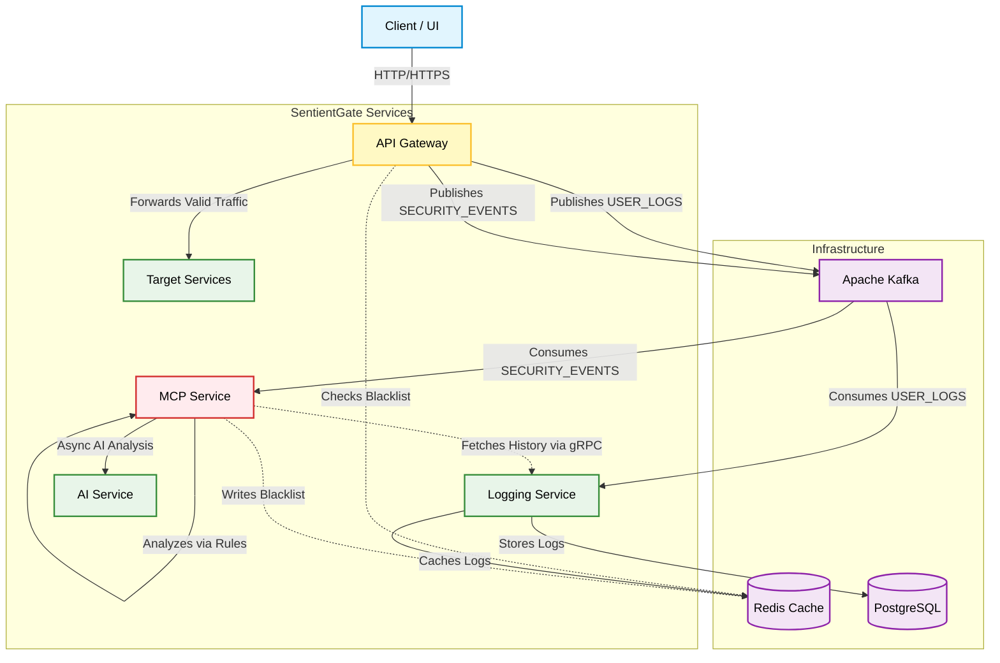
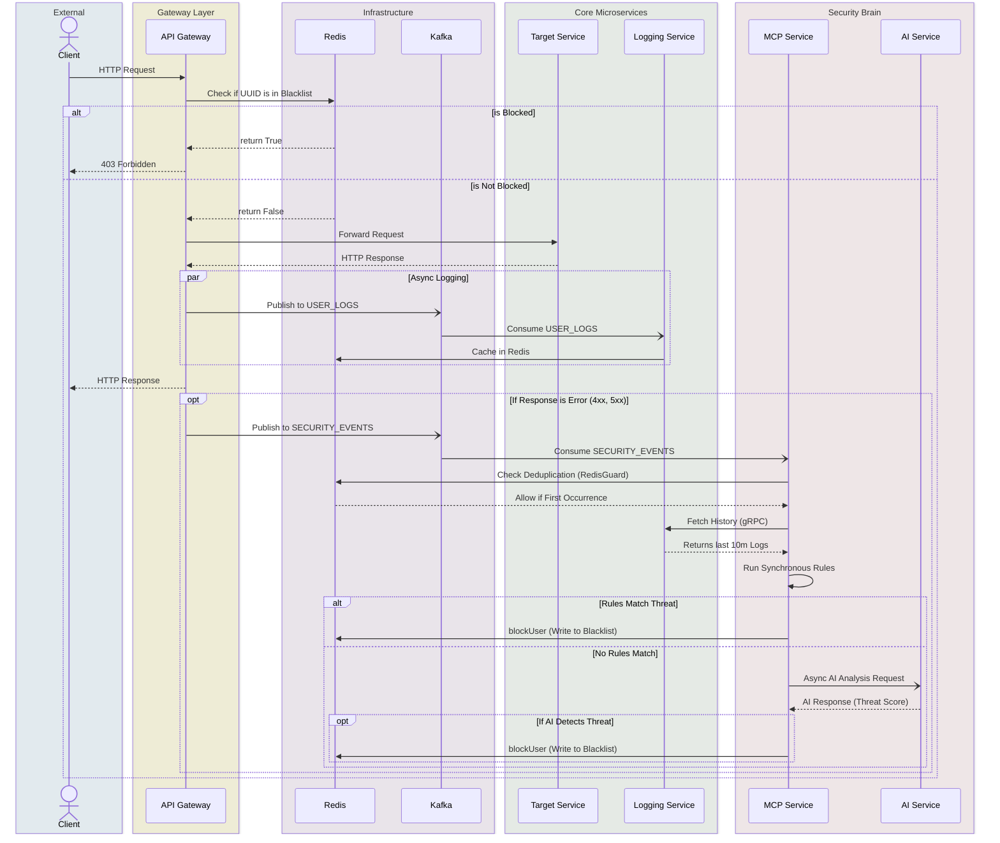

# SentientGate Architecture

This document outlines the high-level architecture and the operational sequence of the SentientGate system. The system employs an out-of-band, event-driven security analysis flow using Apache Kafka and Redis.

## System Architecture

The architectural diagram shows how components are separated between the infrastructure layer and the application microservices.

## Sequence Diagram (Request & Threat Detection Flow)

This sequence diagram illustrates a typical request lifecycle. It highlights how the API Gateway processes requests, logs them asynchronously, and triggers the out-of-band threat detection mechanism.

## Concurrency & Thread Pool Model

To achieve high throughput and reliability, SentientGate uses a mix of Reactive programming and strictly isolated Thread Pools across its services.

### 1. API Gateway & AI Service (Reactive Event Loop)
- Both the **API Gateway** and **AI Service** are built on **Spring WebFlux (Project Reactor)**. 
- They do not use traditional thread-per-request models. Instead, they use a small number of **Netty Event Loop** threads.
- All network calls (Redis checks, target routing, external AI model calls) are completely non-blocking, allowing them to handle thousands of concurrent requests with minimal memory overhead.

### 2. MCP Service (Isolated Thread Pools)
The **MCP Service** processes intensive security rules and acts as the brain of the system. To prevent Kafka lag and ensure high availability, it utilizes two isolated thread pools defined in `AsyncConfig`:

1. **`analysisExecutor` (mcp-analysis-*)**
   - **Core/Max Size**: 8 / 16 threads
   - **Queue Capacity**: 256
   - **Purpose**: When the Kafka Listener consumes a batch of `SECURITY_EVENTS`, it immediately offloads the per-UUID rule analysis to this thread pool. This frees up the Kafka consumer thread to continue polling without waiting for the IO-heavy operations (Redis checks, gRPC history fetching) to complete.
   - **Policy**: `CallerRunsPolicy` to naturally apply backpressure to Kafka if the system is overwhelmed.

2. **`aiExecutor` (mcp-ai-*)**
   - **Core/Max Size**: 4 / 8 threads
   - **Queue Capacity**: 128
   - **Purpose**: A strictly isolated pool dedicated entirely to asynchronous AI inference calls to the AI Service. Since AI models can be slow or experience latency spikes, isolating them in this pool ensures that synchronous rule-based analysis (e.g., Rate Limiting, Burst Traffic) is never starved or blocked by a stalled AI service.

### 3. Logging Service (Kafka Consumers & gRPC)
- Uses default Spring Kafka consumer threads to ingest `USER_LOGS` into PostgreSQL and Redis in bulk.
- Provides a gRPC endpoint served by Tomcat's standard worker thread pool to rapidly serve historical log data back to the MCP Service when requested.
