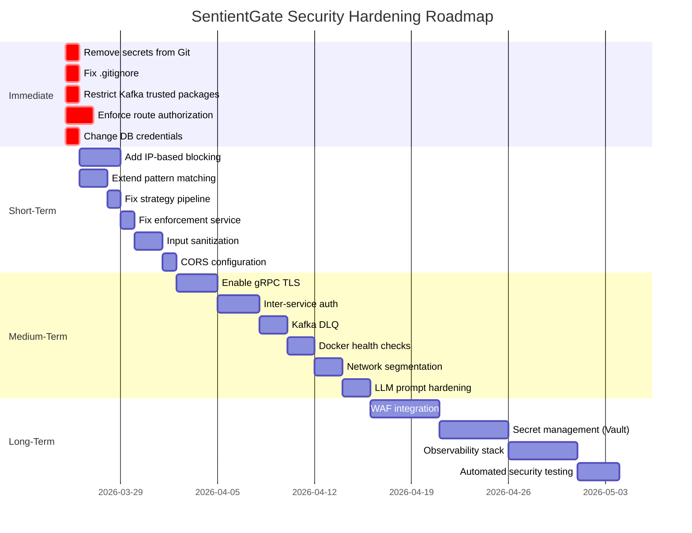

# 🛡️ SentientGate — Security Hardening & Improvement Guide

> Actionable recommendations to make SentientGate production-ready and resilient against cybersecurity attacks.
> Date: 2026-03-25

---

## 🔴 Priority 1 — Immediate (Do Today)

### 1. Remove All Secrets from Git

**Problem**: `private_key.pem`, JWT secrets, HMAC keys, and DB credentials are in source control.

**Fix**:

```bash
# 1. Delete the private key
git rm --cached private_key.pem

# 2. Add to .gitignore
echo "*.pem" >> .gitignore
echo "*.key" >> .gitignore
echo "**/application-local.yml" >> .gitignore

# 3. Rotate ALL compromised keys immediately
#    - Generate new RSA keypair
#    - Generate new JWT secret
#    - Generate new HMAC secret
#    - Change PostgreSQL password

# 4. Scrub git history
git filter-branch --force --index-filter \
  'git rm --cached --ignore-unmatch private_key.pem' \
  --prune-empty --tag-name-filter cat -- --all
```

**Use environment variables for all secrets**:
```yaml
# application.yml
jwt:
  secret-key: ${JWT_SECRET_KEY}

sentinel:
  security:
    secret-key: ${SENTINEL_HMAC_SECRET}

spring:
  datasource:
    password: ${DB_PASSWORD}
```

---

### 2. Fix `.gitignore` Properly

```gitignore
# Secrets
*.pem
*.key
*.p12
*.jks
.env
application-local.yml

# Build artifacts
**/target/
**/build/
**/bin/
**/.gradle/

# IDE
.idea/
.vscode/
*.iml

# Logs
*.log
```

---

### 3. Restrict Kafka Trusted Packages

**File**: MCPService & LoggingService `application.yml`

```diff
-spring.json.trusted.packages: "*"
+spring.json.trusted.packages: "edu.pict.mcpservice.kafkaEvents,edu.pict.apigateway.kafkaEvent"
```

This prevents Remote Code Execution via crafted Kafka messages.

---

### 4. Enforce Route-Level Authorization

**File**: `SecurityConfig.java`

```java
@Bean
public SecurityWebFilterChain securityWebFilterChain(ServerHttpSecurity http) {
    return http
        .csrf(csrf -> csrf.csrfTokenRepository(
            CookieServerCsrfTokenRepository.withHttpOnlyFalse()))
        .cors(Customizer.withDefaults())
        .authorizeExchange(exchange -> exchange
            // Public endpoints
            .pathMatchers("/api/auth/**").permitAll()
            .pathMatchers(HttpMethod.OPTIONS, "/**").permitAll()
            // Internal APIs - require authentication
            .pathMatchers("/api/ai/**").denyAll()         // Internal only
            .pathMatchers("/api/mcp/**").denyAll()         // Internal only
            .pathMatchers("/api/logs/dashboard/**").authenticated()
            .pathMatchers("/api/users/**").authenticated()
            .anyExchange().authenticated()
        )
        .build();
}
```

---

### 5. Change Default Database Credentials

```yaml
# docker-compose.yml
postgres:
  environment:
    POSTGRES_DB: ${POSTGRES_DB:-sentientgate_db}
    POSTGRES_USER: ${POSTGRES_USER:-sentient_admin}
    POSTGRES_PASSWORD: ${POSTGRES_PASSWORD}  # MUST be env var, no default
```

---

## 🟠 Priority 2 — Short-Term (This Week)

### 6. Add IP-Based Blocking (Dual Blacklist)

**Modify `BlacklistFilter.java`** to check both UUID and IP:

```java
@Override
public Mono<Void> filter(ServerWebExchange exchange, GatewayFilterChain chain) {
    String uuid = exchange.getRequest().getHeaders().getFirst(Constants.VISITOR_ID);
    String clientIp = extractRealIp(exchange);

    if (uuid == null) {
        exchange.getResponse().setStatusCode(HttpStatus.UNAUTHORIZED);
        return exchange.getResponse().setComplete();
    }

    Mono<Boolean> uuidBlocked = redisTemplate.hasKey(BLACKLIST_PREFIX + uuid);
    Mono<Boolean> ipBlocked = redisTemplate.hasKey(IP_BLACKLIST_PREFIX + clientIp);

    return Mono.zip(uuidBlocked, ipBlocked)
        .flatMap(tuple -> {
            if (Boolean.TRUE.equals(tuple.getT1()) || Boolean.TRUE.equals(tuple.getT2())) {
                exchange.getResponse().setStatusCode(HttpStatus.FORBIDDEN);
                return exchange.getResponse().setComplete();
            }
            return chain.filter(exchange);
        });
}

private String extractRealIp(ServerWebExchange exchange) {
    String xff = exchange.getRequest().getHeaders().getFirst("X-Forwarded-For");
    if (xff != null && !xff.isEmpty()) {
        return xff.split(",")[0].trim(); // First IP is the real client
    }
    return Objects.requireNonNull(exchange.getRequest().getRemoteAddress())
        .getAddress().getHostAddress();
}
```

**Also modify `EnforcementService`** to block both UUID and IP.

---

### 7. Extend Pattern Matching to All Request Components

```java
@Override
public boolean isAvailable(SecurityAlertEvent alert, List<LogEvent> history) {
    // Check URL path
    String path = alert.getAttemptedPath().toLowerCase();
    if (MALICIOUS_PATTERNS.stream().anyMatch(path::contains)) return true;

    // Check query parameters
    if (history.stream().anyMatch(log -> {
        String params = log.getQueryParams() != null ? log.getQueryParams().toLowerCase() : "";
        return MALICIOUS_PATTERNS.stream().anyMatch(params::contains);
    })) return true;

    // Check User-Agent for known scanner signatures
    String ua = alert.getUserAgent() != null ? alert.getUserAgent().toLowerCase() : "";
    return SCANNER_SIGNATURES.stream().anyMatch(ua::contains);
}

private static final List<String> SCANNER_SIGNATURES = List.of(
    "sqlmap", "nikto", "burpsuite", "nmap", "dirbuster",
    "gobuster", "wfuzz", "masscan", "nuclei"
);
```

---

### 8. Improve Strategy Pipeline — Apply Most Severe Block

Change from `findFirst()` to collecting all matches and applying the most severe:

```java
public void analyze(SecurityAlertEvent alert) {
    List<LogEvent> history = fetchHistory(alert);

    Optional<ThreatStrategy> worstThreat = strategies.stream()
        .filter(s -> s.isAvailable(alert, history))
        .max(Comparator.comparing(s -> s.getBlockDuration()));

    worstThreat.ifPresentOrElse(
        strategy -> enforcementService.blockUser(alert.getUuid(),
            alert.getClientIp(), strategy),
        () -> log.info("✅ No threats for UUID: {}", alert.getUuid())
    );
}
```

---

### 9. Fix `EnforcementService` — Add Error Handling and JSON Serialization

```java
public void blockUser(String uuid, String clientIp, ThreatStrategy strategy) {
    String uuidKey = BLACKLIST_PREFIX + uuid;
    String ipKey = IP_BLACKLIST_PREFIX + clientIp;
    Duration ttl = strategy.getBlockDuration();

    String recordJson = objectMapper.writeValueAsString(
        BlockRecord.builder()
            .reason(strategy.getReason())
            .severity(determineSeverity(ttl))
            .blockedAt(Instant.now().toEpochMilli())
            .expiresAt(Instant.now().plus(ttl).toEpochMilli())
            .build());

    // Block both UUID and IP with proper error handling
    Mono.zip(
        redisTemplate.opsForValue().set(uuidKey, recordJson, ttl),
        redisTemplate.opsForValue().set(ipKey, recordJson, ttl)
    )
    .doOnSuccess(v -> log.info("🛡️ Blocked: UUID={}, IP={}, TTL={}", uuid, clientIp, ttl))
    .doOnError(e -> log.error("❌ Failed to block UUID={}: {}", uuid, e.getMessage()))
    .retry(3)
    .subscribe();
}
```

---

### 10. Sanitize All User Input Before Storage

Add input sanitization utility:

```java
public class InputSanitizer {
    private static final Pattern SCRIPT_TAG = Pattern.compile("<script[^>]*>.*?</script>",
        Pattern.CASE_INSENSITIVE | Pattern.DOTALL);
    private static final int MAX_FIELD_LENGTH = 2048;

    public static String sanitize(String input) {
        if (input == null) return null;
        String clean = SCRIPT_TAG.matcher(input).replaceAll("");
        clean = StringEscapeUtils.escapeHtml4(clean);
        return clean.length() > MAX_FIELD_LENGTH ?
            clean.substring(0, MAX_FIELD_LENGTH) : clean;
    }
}
```

Apply in `KafkaBatchService` before persisting to PostgreSQL.

---

### 11. Add Request Body Size Limits

```yaml
# ApiGateway application.yml
spring:
  codec:
    max-in-memory-size: 1MB
  cloud:
    gateway:
      httpclient:
        max-header-size: 16KB
```

---

### 12. Make CORS Environment-Configurable

```java
@Bean
public CorsWebFilter corsWebFilter(
        @Value("${cors.allowed-origins}") List<String> allowedOrigins) {
    CorsConfiguration corsConfig = new CorsConfiguration();
    corsConfig.setAllowedOrigins(allowedOrigins);
    corsConfig.setAllowedMethods(Arrays.asList("GET", "POST", "PUT", "DELETE"));
    corsConfig.setAllowedHeaders(Arrays.asList(
        "Authorization", "Content-Type", "X-Requested-With"));
    corsConfig.setAllowCredentials(true);
    corsConfig.setMaxAge(3600L);
    // ... rest
}
```

```yaml
cors:
  allowed-origins:
    - ${CORS_ORIGIN_1:http://localhost:5173}
    - ${CORS_ORIGIN_2:https://sentient-gate.vercel.app}
```

---

## 🟡 Priority 3 — Medium-Term (This Month)

### 13. Enable TLS for gRPC Communication

```yaml
# MCPService application.yml
grpc:
  client:
    logging-service:
      address: discovery:///LOGGING-SERVICE
      negotiation-type: tls
      security:
        certificate-chain: classpath:certs/client.crt
        private-key: classpath:certs/client.key
        trust-certificate-collection: classpath:certs/ca.crt
```

---

### 14. Implement Inter-Service Authentication

Add a shared API key or mutual TLS:

```java
// ServiceAuthInterceptor.java — for gRPC
public class ServiceAuthInterceptor implements ServerInterceptor {
    @Override
    public <ReqT, RespT> ServerCall.Listener<ReqT> interceptCall(
            ServerCall<ReqT, RespT> call, Metadata headers,
            ServerCallHandler<ReqT, RespT> next) {
        String apiKey = headers.get(API_KEY_HEADER);
        if (!validApiKeys.contains(apiKey)) {
            call.close(Status.UNAUTHENTICATED, new Metadata());
            return new ServerCall.Listener<>() {};
        }
        return next.startCall(call, headers);
    }
}
```

---

### 15. Add Kafka Dead Letter Queue (DLQ)

```java
@Bean
public ConcurrentKafkaListenerContainerFactory<String, SecurityAlertEvent>
        kafkaListenerContainerFactory() {
    var factory = new ConcurrentKafkaListenerContainerFactory<>();
    factory.setConsumerFactory(consumerFactory());
    factory.setCommonErrorHandler(new DefaultErrorHandler(
        new DeadLetterPublishingRecoverer(kafkaTemplate),
        new FixedBackOff(1000L, 3) // 3 retries, 1s apart
    ));
    return factory;
}
```

---

### 16. Add Docker Health Checks for All Services

```yaml
# docker-compose.yml
redis:
  healthcheck:
    test: ["CMD", "redis-cli", "ping"]
    interval: 10s
    timeout: 5s
    retries: 5

kafka:
  healthcheck:
    test: ["CMD-SHELL", "kafka-broker-api-versions --bootstrap-server localhost:9092"]
    interval: 15s

api-gateway:
  healthcheck:
    test: ["CMD", "curl", "-f", "http://localhost:8079/actuator/health"]
    interval: 15s
  depends_on:
    redis:
      condition: service_healthy
    kafka:
      condition: service_healthy
```

---

### 17. Add Docker Network Segmentation

```yaml
networks:
  infrastructure:
    driver: bridge
  application:
    driver: bridge
  frontend:
    driver: bridge

services:
  postgres:
    networks: [infrastructure]
  redis:
    networks: [infrastructure, application]
  kafka:
    networks: [infrastructure, application]
  api-gateway:
    networks: [application, frontend]
  sentinel-ui:
    networks: [frontend]
```

---

### 18. Configure Log Rotation

```yaml
# docker-compose.yml — for all services
logging:
  driver: "json-file"
  options:
    max-size: "10m"
    max-file: "5"
```

For Spring Boot, add `logback-spring.xml` with rolling file appender.

---

### 19. Protect Against LLM Prompt Injection

```java
private String buildPrompt(AnomalyDetectionRequest req) {
    // Validate all inputs are numeric — never interpolate user strings
    double failureRate = Math.max(0, Math.min(1, req.getFailureRate()));
    int rpm = Math.max(0, Math.min(10000, req.getRequestsPerMinute()));
    int routes = Math.max(0, Math.min(1000, req.getUniqueRoutesAccessed()));

    return """
        Analyze these NUMERIC ONLY behavioral signals.
        Return ONLY a single decimal number between 0.0 and 1.0.
        Do not return text.

        failureRate=%.4f
        requestsPerMinute=%d
        uniqueRoutes=%d
        jwtReuse=%d
        """.formatted(failureRate, rpm, routes, req.getJwtReuseCount());
    // REMOVED: routeSensitivity (string field) — never pass user strings to LLM
}
```

---

### 20. Improve Burst Traffic Detection

Use sliding window rate calculation instead of fixed thresholds:

```java
@Override
public boolean isAvailable(SecurityAlertEvent alert, List<LogEvent> history) {
    if (history.size() < 5) return false;

    // Sliding window: check requests per minute
    long now = System.currentTimeMillis();
    long oneMinuteAgo = now - 60_000;

    long recentCount = history.stream()
        .filter(log -> log.getTimestamp() > oneMinuteAgo)
        .count();

    // More than 60 requests per minute = suspicious
    if (recentCount > 60) return true;

    // Check for micro-bursts: 10+ requests in 2 seconds
    for (int i = 0; i < history.size() - 9; i++) {
        long window = history.get(i + 9).getTimestamp() - history.get(i).getTimestamp();
        if (window < 2000) return true;
    }
    return false;
}
```

---

### 21. Replace `assert` with Proper Null Handling

```diff
-assert uuid != null;
-kafkaTemplate.send(KafkaTopics.USER_LOGS.topic(), uuid, logEvent);
+if (uuid != null) {
+    kafkaTemplate.send(KafkaTopics.USER_LOGS.topic(), uuid, logEvent);
+} else {
+    log.warn("Skipping log event: visitor UUID is null for path {}", path);
+}
```

---

### 22. Fix `ddl-auto` for Production

```yaml
spring:
  jpa:
    hibernate:
      ddl-auto: ${DDL_AUTO:validate}  # Only 'update' for dev
    show-sql: ${SHOW_SQL:false}
```

Use **Flyway** or **Liquibase** for production migrations:

```gradle
implementation 'org.flywaydb:flyway-core'
```

---

## 🔵 Priority 4 — Long-Term (Ongoing)

### 23. Add Comprehensive Cybersecurity Attack Detection

Extend the strategy pipeline to handle more attack types:

| Attack Type | Detection Method | New Strategy |
|-------------|-----------------|--------------|
| **DDoS** | Request rate per IP subnet | `SubnetFloodStrategy` |
| **Credential Stuffing** | Multiple auth failures for different users from same IP | `CredentialStuffingStrategy` |
| **API Abuse** | Unusual API call sequences | `ApiSequenceAnomalyStrategy` |
| **Session Hijacking** | Same JWT from different IPs/user-agents | `SessionFingerprintStrategy` |
| **SSRF** | Internal IP/hostname in request params | `SsrfDetectionStrategy` |
| **Cookie Theft** | Visitor UUID used from different IP ranges | `CookieAnomalyStrategy` |
| **Bot Detection** | Missing headers, rapid enumeration | `BotFingerprintStrategy` |

---

### 24. Add a WAF (Web Application Firewall) Layer

Consider adding **ModSecurity** or **OWASP CRS** in front of the API Gateway:

```yaml
# docker-compose.yml
waf:
  image: owasp/modsecurity-crs:nginx
  ports:
    - "80:80"
  environment:
    - BACKEND=http://api-gateway:8079
  depends_on:
    - api-gateway
```

---

### 25. Implement Centralized Secret Management

Use **HashiCorp Vault** or **AWS Secrets Manager**:

```java
// VaultConfig.java
@Configuration
public class VaultConfig {
    @Bean
    public VaultTemplate vaultTemplate() {
        return new VaultTemplate(
            VaultEndpoint.create("vault", 8200),
            new TokenAuthentication("root-token"));
    }
}
```

---

### 26. Add Observability Stack

Deploy monitoring and alerting:
- **Prometheus** + **Grafana** for metrics
- **ELK Stack** (Elasticsearch, Logstash, Kibana) for centralized logging
- **Jaeger/Zipkin** for distributed tracing
- Set up alerts for: Redis failures, Kafka lag, gRPC errors, high error rates

---

### 27. Add Automated Security Testing

```bash
# Add to CI/CD pipeline
# 1. SAST (Static Application Security Testing)
./mvnw spotbugs:check
./mvnw org.owasp:dependency-check-maven:check

# 2. DAST (Dynamic Application Security Testing)
docker run -t owasp/zap2docker-stable zap-api-scan.py \
    -t http://api-gateway:8079 -f openapi

# 3. Container scanning
docker run --rm anchore/grype shrihari7396/api-gateway:latest
```

---

### 28. Write a Real `SECURITY.md`

Replace the placeholder with actual security policy:

```markdown
# Security Policy

## Reporting a Vulnerability
Email: security@sentientgate.dev
PGP Key: [link]
Response Time: 48 hours

## Supported Versions
| Version | Supported |
|---------|-----------|
| 1.x     | ✅        |

## Security Measures
- All secrets managed via Vault
- TLS enforced on all inter-service communication
- OWASP Top 10 mitigations in place
- Regular dependency scanning via Dependabot
```

---

## Summary — Implementation Roadmap


