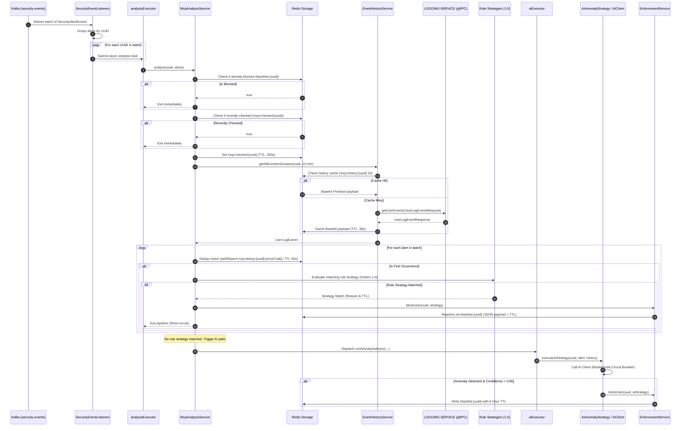

# MCPService — Real-Time Threat Analysis & Enforcement Engine

`MCPService` (Master Control Program Service) is the central real-time security threat analysis and blacklist enforcement engine of the **SentientGate** API Gateway architecture. 

It consumes security event alerts from **Apache Kafka**, enriches threat context by fetching recent request history via **gRPC** from `LOGGING-SERVICE`, evaluates threats through a cost-optimized **Strategy Pattern** pipeline, and enforces blacklisting decisions in **Redis** with dynamic Time-to-Live (TTL) expiration.

---

## Table of Contents
1. [Executive Summary & System Purpose](#executive-summary--system-purpose)
2. [High-Level Architecture](#high-level-architecture)
3. [End-to-End Sequence Diagram](#end-to-end-sequence-diagram)
4. [Thread Execution & Concurrency Architecture](#thread-execution--concurrency-architecture)
5. [Threat Analysis Pipeline & Strategy Cost Model](#threat-analysis-pipeline--strategy-cost-model)
   - [Short-Circuit Guards](#short-circuit-guards)
   - [Strategy Ordering & Matrix](#strategy-ordering--matrix)
   - [Rule vs. AI Execution Path](#rule-vs-ai-execution-path)
6. [Distributed State & Redis Key Design](#distributed-state--redis-key-design)
7. [Inter-Service Communication Protocols](#inter-service-communication-protocols)
   - [Kafka Event Ingestion](#kafka-event-ingestion)
   - [gRPC Log History Fetching](#grpc-log-history-fetching)
   - [Feign AI Client & Resilience4j Circuit Breaker](#feign-ai-client--resilience4j-circuit-breaker)
8. [Resilience4j Circuit Breaker & Fallback Architecture](#resilience4j-circuit-breaker--fallback-architecture)
9. [Configuration Reference (`application.yml`)](#configuration-reference-applicationyml)
10. [Operational Management & Observability](#operational-management--observability)
11. [Build, Deployment & Testing](#build-deployment--testing)
12. [Known Caveats & Architectural Recommendations](#known-caveats--architectural-recommendations)

---

## Executive Summary & System Purpose

In high-throughput gateway environments, detecting and mitigating malicious traffic must happen in milliseconds without impacting healthy user traffic. `MCPService` achieves this by combining ultra-fast rule-based pattern matching with asynchronous AI anomaly detection.

### Key Objectives
* **Sub-Millisecond Blacklist Lookup**: Writes block records directly to Redis (`blacklist:{uuid}`) so API Gateways can instantly drop blocked clients at the edge.
* **Cost Optimization**: Executes zero-cost pattern matching rules first. Expensive AI inference calls are only executed if no deterministic rule matches.
* **Horizontal Scalability**: Employs Redis-based deduplication and checked-state windows to prevent duplicate execution across scaled instances.
* **Fault Isolation**: Isolates I/O-bound gRPC history fetching and CPU/network-heavy AI calls into separate thread pools with Resilience4j circuit breaker fallback protection.

---

## High-Level Architecture

```
                                  +---------------------------------+
                                  |     Apache Kafka Cluster        |
                                  |     Topic: security-events      |
                                  +----------------+----------------+
                                                   |
                                                   v (Batch Poll)
                                  +----------------+----------------+
                                  |    SecurityEventListeners       |
                                  +----------------+----------------+
                                                   |
                                                   v (Dispatch per UUID)
                                  +----------------+----------------+
                                  |      analysisExecutor Pool      |
                                  +----------------+----------------+
                                                   |
                                                   v
                                  +----------------+----------------+
                                  |       McpAnalysisService        |
                                  +--------+---------------+--------+
                                           |               |
               +---------------------------+               +---------------------------+
               | (Guard & Dedup Check)                     | (gRPC History Fetch)      |
               v                                           v                           v
+--------------+---------------+             +-------------+---------------+  +--------+-------+
|        Redis Cluster         |             |   EventHistoryService       |  | LOGGING-SERVICE|
|  - mcp:dedup:{uuid}:{code}   |             |   (30s Base64 Protobuf    |  | (gRPC Server)  |
|  - mcp:checked:{uuid}        |             |    Redis Cache)             |  +----------------+
|  - blacklist:{uuid}          |             +-------------+---------------+
+--------------+---------------+                           |
               ^                                           v
               |                             +-------------+---------------+
               |                             | Rule Strategies (Orders 1-5)|
               |                             +-------------+---------------+
               | (Block User)                              | (No Rule Match)
               +<------------------------------------------+
               |                                           v
               |                             +-------------+---------------+
               |                             |     aiExecutor Pool         |
               |                             +-------------+---------------+
               |                                           |
               |                                           v
               |                             +-------------+---------------+  +----------------+
               | (Block User)                |    AiAnomalyStrategy        |->|   AI Inference |
               +<----------------------------|  (Resilience4j Protected)   |  |     Service    |
                                             +-----------------------------+  +----------------+
```

---

## End-to-End Sequence Diagram



---

## Thread Execution & Concurrency Architecture

`MCPService` avoids blocking Kafka polling threads by delegating analysis work to isolated, custom Spring `ThreadPoolTaskExecutor` beans configured in [`AsyncConfig`](src/main/java/edu/pict/mcpservice/config/AsyncConfig.java).

### Thread Pool Specifications

| Pool Name | Core Size | Max Size | Queue Capacity | Rejection Policy | Purpose |
|-----------|-----------|----------|----------------|------------------|---------|
| `analysisExecutor` | 8 | 16 | 256 | `CallerRunsPolicy` | Primary threat analysis worker pool offloaded from Kafka listener threads. Handles Redis lookups, rule evaluation, and gRPC I/O. |
| `aiExecutor` | 4 | 8 | 128 | `CallerRunsPolicy` | Isolated executor pool for AI inference calls. Prevents high latency or timeouts in AI Service from consuming core analysis threads. |

### Concurrency Flow
1. **Kafka Listener Thread**: `SecurityEventListeners.onSecurityAlertBatch(...)` receives a batch of events (up to 500 records), groups them by `uuid`, and immediately dispatches one lambda task per UUID to `analysisExecutor`.
2. **Analysis Threads**: Execute short-circuit guard checks, fetch history, and run rule-based strategies.
3. **AI Task Handoff**: If rule strategies yield no match, the task is handed off to `aiExecutor` via `CompletableFuture.runAsync(...)`, allowing the `analysisExecutor` thread to complete and return to the pool immediately.

---

## Threat Analysis Pipeline & Strategy Cost Model

### Short-Circuit Guards (`RedisGuardService`)

Before fetching history or running strategies, the dedicated `RedisGuardService` applies three fast-path short-circuits:

1. **Blacklist Short-Circuit**: Checks `blacklist:{uuid}` in Redis. If the user is already blocked, processing aborts immediately.
2. **Checked-Window Short-Circuit**: Checks `mcp:checked:{uuid}` in Redis (200-second window). If the UUID was recently checked and not blocked, duplicate checks in the same window are skipped.
3. **Alert Deduplication**: Checks `mcp:dedup:{uuid}:{errorCode}` via atomic `setIfAbsent` with a 30-second TTL. Prevents redundant strategy evaluation for repeated alerts of the same type within 30 seconds.

### Input Normalization (`InputNormalizer`)

To prevent encoding-based bypasses, all incoming alerts and historical logs are passed through a centralized, 4-step normalization pipeline before rule evaluation:
1. Iterative URL-decoding (up to 3 passes to prevent DoS)
2. SQL comment stripping (`/* ... */`)
3. Unicode NFKC normalization
4. Lowercasing

### Strategy Ordering & Matrix

Strategies implement the [`ThreatStrategy`](src/main/java/edu/pict/mcpservice/stratagies/blocking/ThreatStrategy.java) interface and use Spring's `@Order` annotation to establish strict priority. Cheap, deterministic rules run first; expensive AI inference runs last. **Crucially, every strategy analyzes both the current alert AND the historical logs** to detect fragmented attacks.

| Order | Strategy Class | Primary Trigger & Logic | Block TTL | Severity | Reason Code |
|-------|----------------|-------------------------|-----------|----------|-------------|
| **1** | `PatternMatchStrategy` | Compiled regex patterns for SQLi (`(?<![\w-])select(?![\w-])`, `union`), XSS (`<script>`), Path Traversal, and Command Injection. Scans both current alert and log history. | 1 Day | `CRITICAL` | `CRITICAL_INJECTION_ATTEMPT` |
| **2** | `SensitivePathStrategy` | 14 compiled regex patterns for recon targets: `/wp-admin`, `/.env`, `/config.php`, `/admin/login`, `/.git`, `/actuator`, etc. Scans both alert and log history. | 7 Days | `CRITICAL` | `SENSITIVE_PATH_RECONNAISSANCE` |
| **3** | `RateLimitCoolDownStrategy` | Incoming alert `errorCode` equals `429` AND history contains >= 3 previous `429` errors (differentiates persistent scanners from accidental bursts). | 15 Minutes | `LOW` | `Aggressive polling detected. 15m cool-down.` |
| **4** | `HighErrorRateStrategy` | History contains > 5 requests AND HTTP error status codes (>=400) account for > 70% of requests. | 2 Hours | `MEDIUM` | `HIGH_ERROR_RATE_SCANNER_DETECTED` |
| **5** | `BurstTrafficStrategy` | History contains >= 20 requests where the time delta between the first and last request is < 5000ms (5 seconds). | 30 Minutes | `LOW` | `BURST_TRAFFIC_DETECTED_BOT_SUSPECT` |
| **6** | `AiAnomalyStrategy` | Invokes `AIClient` via Feign. Matched when `isAnomaly == true` AND `confidenceScore > 0.85`. Requires history size >= 5. | 6 Hours | `MEDIUM` | `AI_BEHAVIORAL_ANOMALY_DETECTED` |

---

## Distributed State & Redis Key Design

`MCPService` relies on Redis to maintain state across horizontally scaled instances without requiring inter-node cluster state synchronization.

```
┌────────────────────────────────────────────────────────────────────────────────────────┐
│                                   REDIS KEY MAP                                        │
├───────────────────────────────┬───────────────────────┬───────────────┬────────────────┤
│ Key Pattern                   │ Data Type / Value     │ Default TTL   │ Purpose        │
├───────────────────────────────┼───────────────────────┼───────────────┼────────────────┤
│ blacklist:{uuid}              │ JSON (BlockRecord)    │ Dynamic       │ Active block   │
│                               │                       │ (15m - 7d)    │ record         │
├───────────────────────────────┼───────────────────────┼───────────────┼────────────────┤
│ mcp:dedup:{uuid}:{errorCode}  │ String (Epoch MS)     │ 30 Seconds    │ Alert dedup    │
├───────────────────────────────┼───────────────────────┼───────────────┼────────────────┤
│ mcp:checked:{uuid}            │ String (Epoch MS)     │ 200 Seconds   │ Checked guard  │
├───────────────────────────────┼───────────────────────┼───────────────┼────────────────┤
│ mcp:history:{uuid}:{duration} │ Base64 String         │ 30 Seconds    │ Cached gRPC    │
│                               │ (Protobuf bytes)      │               │ log history    │
└───────────────────────────────┴───────────────────────┴───────────────┴────────────────┘
```

### Blacklist Record Format (`blacklist:{uuid}`)

When a block is triggered, [`EnforcementService`](src/main/java/edu/pict/mcpservice/service/EnforcementService.java) writes a serialized [`BlockRecord`](src/main/java/edu/pict/mcpservice/model/BlockRecord.java) to Redis:

```json
{
  "reason": "CRITICAL_INJECTION_ATTEMPT",
  "severity": "CRITICAL",
  "blockedAt": 1722786789000,
  "expiresAt": 1722873189000
}
```

* **Severity Mapping**:
  * `ttl >= 24 hours` $\rightarrow$ `CRITICAL`
  * `ttl >= 1 hour` $\rightarrow$ `MEDIUM`
  * `ttl < 1 hour` $\rightarrow$ `LOW`

---

## Inter-Service Communication Protocols

### Kafka Event Ingestion

* **Topic**: `security-events`
* **Listener Class**: `SecurityEventListeners`
* **Listener Mode**: Batch Mode (`spring.kafka.listener.type=batch`)
* **Concurrency**: `3` worker threads
* **Type Mapping**: JSON deserializer maps gateway alert payloads (`edu.pict.apigateway.kafkaEvent.SecurityAlertEvent`) to service DTOs (`edu.pict.mcpservice.kafkaEvents.SecurityAlertEvent`).

### gRPC Log History Fetching

* **Service Stub**: `UserLogEventServiceGrpc.UserLogEventServiceBlockingStub`
* **Discovery URI**: `discovery:///LOGGING-SERVICE` (Eureka resolution)
* **Proto Contract**: [`user_log_event.proto`](src/main/proto/user_log_event.proto)
* **Method**: `getUserEvents(UserLogEventsRequest)`
* **Caching Strategy**: Resulting Protobuf messages are serialized to raw byte arrays, encoded in Base64, and saved in Redis key `mcp:history:{uuid}:{duration}` for 30 seconds.
* **Race Condition Mitigation**: `EventHistoryService` introduces a nominal `100ms` pause prior to gRPC fetching to allow preceding Kafka log writes in `LOGGING-SERVICE` to complete.

### Feign AI Client & Resilience4j Circuit Breaker

* **Target Service**: `ai-service` (`/ai-service/api/v1/analyze`)
* **Feign Interface**: [`AiServiceFeignClient`](src/main/java/edu/pict/mcpservice/clients/AiServiceFeignClient.java)
* **Protection**: Resilience4j Circuit Breaker (`ai-service-circuit-breaker`)

---

## Resilience4j Circuit Breaker & Fallback Architecture

To shield `MCPService` from failure propagation if `ai-service` experiences degradation or downtime, all AI calls pass through Resilience4j.

### Circuit Breaker Configuration

```yaml
resilience4j:
  circuitbreaker:
    instances:
      ai-service-circuit-breaker:
        slidingWindowSize: 10
        minimumNumberOfCalls: 5
        failureRateThreshold: 50       # Opens if >=50% of calls fail
        slowCallRateThreshold: 50      # Opens if >=50% of calls take > 2s
        slowCallDurationThreshold: 2s
        waitDurationInOpenState: 10s   # Remains OPEN for 10s before testing recovery
        permittedNumberOfCallsInHalfOpenState: 3
        automaticTransitionFromOpenToHalfOpenEnabled: true
```

### Circuit Breaker State Machine

```
              [ CLOSED ] (Normal Operation)
                  |
                  | Failure Rate > 50% OR Slow Calls (>2s) > 50%
                  v
               [ OPEN ] (Service Unavailable - Fail Fast)
                  |
                  | Wait 10 Seconds
                  v
            [ HALF-OPEN ] (Testing Recovery with 3 Probes)
             /          \
  All 3 Pass/            \ Any Probe Fails
           v              v
      [ CLOSED ]       [ OPEN ]
```

### Fallback Behavior (Fail-Open)

When the circuit breaker is `OPEN` or an exception occurs during the Feign request, `AiServiceFeignClient.analyzeFallback(...)` returns a default non-blocking response:

```java
default ResponseEntity<AnomalyDetectionResponse> analyzeFallback(AnomalyDetectionRequest request, Exception ex) {
    return ResponseEntity.ok(
        AnomalyDetectionResponse.builder()
            .isAnomaly(false)
            .confidenceScore(0.0)
            .patternDetected("SERVICE_UNAVAILABLE")
            .suggestedBlockMinutes(0)
            .build()
    );
}
```

This guarantees **Fail-Open safety**: healthy traffic is never accidentally blocked due to downstream AI service outages.

---

## Configuration Reference (`application.yml`)

```yaml
server:
  port: 9991
  servlet:
    context-path: /mcp-service

spring:
  application:
    name: mcp-server
  data:
    redis:
      host: ${SPRING_DATA_REDIS_HOST:localhost}
      port: ${SPRING_DATA_REDIS_PORT:6379}
  kafka:
    bootstrap-servers: ${SPRING_KAFKA_BOOTSTRAP_SERVERS:localhost:9092}
    consumer:
      group-id: sentientgate-mcp-service
      auto-offset-reset: earliest
      enable-auto-commit: false
      max-poll-records: 500
      key-deserializer: org.apache.kafka.common.serialization.StringDeserializer
      value-deserializer: org.springframework.kafka.support.serializer.JsonDeserializer
    listener:
      concurrency: 3
      type: batch
      ack-mode: batch

eureka:
  client:
    service-url:
      defaultZone: ${EUREKA_CLIENT_SERVICEURL_DEFAULTZONE:http://localhost:8761/eureka}
  instance:
    prefer-ip-address: true

grpc:
  server:
    port: -1
  client:
    logging-service:
      address: discovery:///LOGGING-SERVICE
      negotiation-type: plaintext
```

---

## Operational Management & Observability

### Actuator Endpoints

`MCPService` exposes management and health endpoints via Spring Boot Actuator:

* **Overall Health & Circuit Breaker Status**:
  ```bash
  curl -s http://localhost:9991/mcp-service/actuator/health | jq
  ```
* **Circuit Breaker State Transition Events**:
  ```bash
  curl -s http://localhost:9991/mcp-service/actuator/circuitbreakerevents | jq
  ```
* **Prometheus Metrics**:
  ```bash
  curl -s http://localhost:9991/mcp-service/actuator/metrics
  ```

---

## Build, Deployment & Testing

### Prerequisites
* JDK 21
* Gradle 8.x
* Running instances of Redis (Port 6379), Kafka (Port 9092), and Eureka Server (Port 8761)

### Local Build & Execution

```bash
# Navigate to service directory
cd MCPService

# Clean and run unit tests
./gradlew clean test

# Boot run locally
./gradlew bootRun
```

### Docker Containerization

```bash
# Build Docker image
docker build -t sentientgate/mcp-service:latest .

# Run Container
docker run -d \
  --name mcp-service \
  -p 9991:9991 \
  -e SPRING_DATA_REDIS_HOST=redis-host \
  -e SPRING_KAFKA_BOOTSTRAP_SERVERS=kafka-host:9092 \
  -e EUREKA_CLIENT_SERVICEURL_DEFAULTZONE=http://eureka-host:8761/eureka \
  sentientgate/mcp-service:latest
```

---

## Known Caveats & Architectural Recommendations

1. **Kafka Consumer Group ID Mismatch**:
   * *Observation*: `SecurityEventListeners` specifies `@KafkaListener(groupId = "mcp-analysis-group")`, overriding `application.yml` (`sentientgate-mcp-service`).
   * *Recommendation*: Standardize consumer group configuration across property files and annotations.
2. **Log Level in Enforcement Service**:
   * *Observation*: `EnforcementService.blockUser(...)` logs successful block writes with `log.error(...)` instead of `log.info(...)`.
   * *Recommendation*: Change `log.error` to `log.warn` or `log.info` to avoid false positives in log aggregation alerting.
3. **Dedicated Metric Counters**:
   * *Recommendation*: Introduce Micrometer counters for `mcp.dedup.skips`, `mcp.strategy.hits`, and `mcp.blocks.executed` for enhanced Grafana dashboard metrics.
