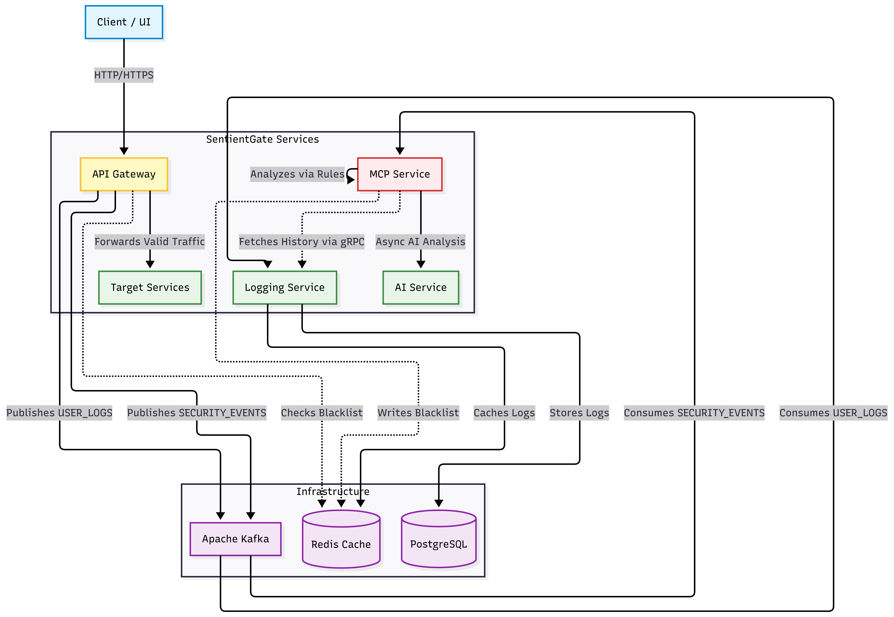
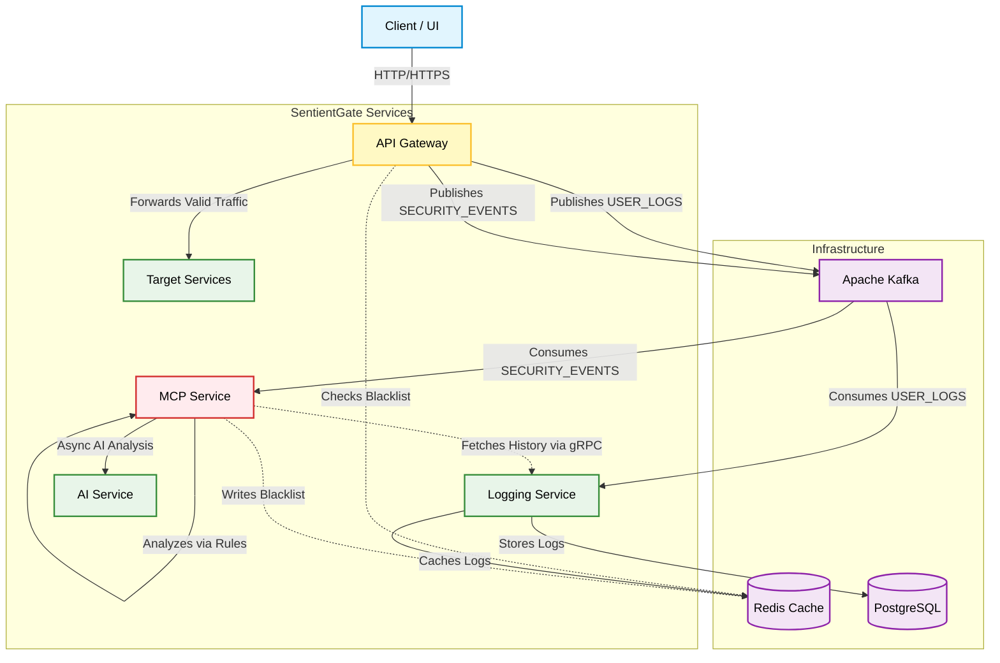
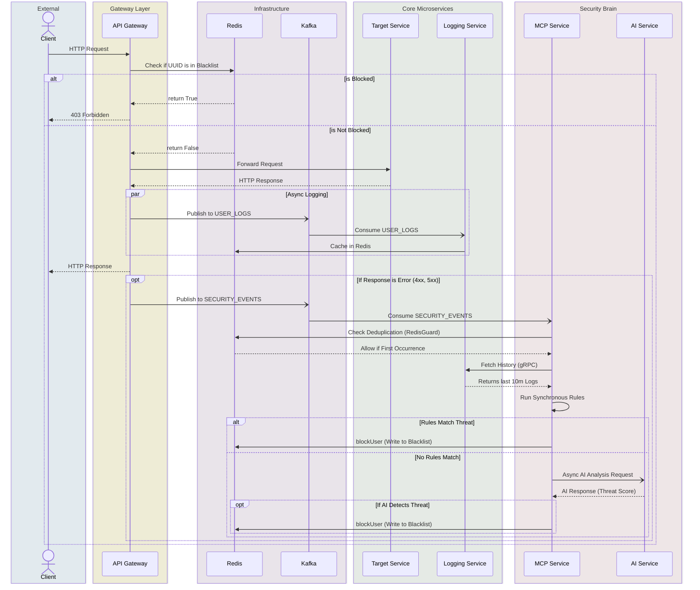

# SentientGate: AI-Powered Runtime Security for Cloud-Native Microservices

SentientGate is a distributed security platform that sits in front of microservices, observes traffic in real time, detects suspicious behavior, and takes temporary enforcement actions before attacks spread.

## The Story

Most API security setups fail in one of two ways:
1. They are static and rule-only, so they miss evolving attacks.
2. They are powerful but expensive, slow, and hard to run privately.

SentientGate is built to solve that gap. It combines fast gateway enforcement with event-driven analysis, historical context, and local AI inference to make security decisions that are both fast and adaptive. 

Instead of blocking forever, it applies TTL-based temporary blocks, learns from behavior, and keeps services available under load.

## What SentientGate Is

SentientGate is a microservice security fabric with these core capabilities:
- **Real-time request filtering** at the gateway edge (WebFlux/Reactor)
- **Event-driven threat analysis** with Kafka
- **Behavioral history analysis** via gRPC
- **Layered detection** with strategy-based scoring (Burst, Pattern, Config Paths)
- **Dynamic temporary blocking** via Redis TTL
- **Local LLM anomaly checks** using Ollama
- **Operational visibility** through a React dashboard

## Technologies Used

- [](https://openjdk.org/projects/jdk/21/)
- [](https://spring.io/projects/spring-boot)
- [](https://kafka.apache.org/)
- [](https://redis.io/)
- [](https://www.postgresql.org/)
- [](https://grpc.io/)
- [](https://ollama.com/)
- [](https://react.dev/)
- [](https://kubernetes.io/)
- [](https://www.docker.com/)

## Architecture & Data Flow

<div align="center">
  
</div>



SentientGate utilizes an **Event-Driven, Out-of-Band Analysis** architecture. 
1. **API Gateway** checks Redis for active blocks. If allowed, it forwards traffic and asynchronously logs the event to Kafka.
2. **Logging Service** persists logs to PostgreSQL and exposes a rapid gRPC API for history queries.
3. **MCP Service (Malicious Client Protection)** consumes Kafka security events, fetches history via gRPC, and runs rapid synchronous heuristics using isolated Thread Pools.
4. **AI Service** provides deep asynchronous behavioral analysis using local LLMs.
5. Detected threats result in immediate TTL-based blocks written back to Redis.

### Sequence Flow

<div align="center">
  
</div>



## Services

| Service | Purpose | Default Port | Framework |
|---|---|---|---|
| `ApiGateway` | Entry point, filtering, rate limiting, Redis enforcement | `8079` | Spring WebFlux |
| `MCPService` | Security brain, strategy analysis, enforcement decisions | `8080` | Spring Boot (Isolated Thread Pools) |
| `AIService` | Local LLM-based anomaly analysis via Ollama | `8082` | Spring WebFlux |
| `LoggingService` | Log persistence, gRPC behavior history | `8010` | Spring Boot + gRPC |
| `EurekaServer` | Service discovery registry | `8761` | Spring Cloud Netflix |
| `Dummy` | Protected downstream test service | `8090` | Spring Boot |
| `sentinel-gateway-ui`| Monitoring dashboard | `5173` | React, Vite |

## Repository Structure

```text
SentientGate/
├── ApiGateway/
├── MCPService/
├── AIService/
├── LoggingService/
├── EurekaServer/
├── Dummy/
├── UI/sentinel-gateway-ui/
├── k8s/                     # Consolidated Kubernetes manifests
├── scripts/                 # Automation scripts (test, build, deploy)
├── TOOLS/                   # Local infrastructure docker-compose
├── .github/workflows/       # CI/CD Pipelines
├── ARCHITECTURE.md          # In-depth Mermaid diagrams
└── README.md
```

## Quick Start (Local Development)

### 1. Start Infrastructure & Services
We provide automation scripts to easily spin up Postgres, Redis, Kafka, and the microservices locally.
```bash
./scripts/run_local.sh
```
*Note: This script launches the infrastructure and sequentially boots up all microservices.*

### 2. Run Tests
Execute the full integration test suite across all services:
```bash
./scripts/test_local.sh
```

### 3. Stop Environment
```bash
./scripts/stop_local.sh
```

## Kubernetes Deployment (Production Ready)

SentientGate includes consolidated, production-ready Kubernetes manifests in the `k8s/` directory. Instead of fragmented folders, we use consolidated `manifest.yml` files for each service (e.g., `k8s/api-gateway-manifest.yml`) containing all necessary ConfigMaps, Deployments, Services, and HPAs.

### Deploying to Minikube or any K8s Cluster

1. Start Minikube:
```bash
minikube start
```

2. Build and push your Docker images to your registry:
```bash
./scripts/build_and_push_images.sh
```

3. Deploy all services to Kubernetes:
```bash
./scripts/deploy.sh
```

## CI/CD Automation

SentientGate utilizes GitHub Actions for seamless continuous integration:
- **Tests Workflow** (`.github/workflows/test.yml`): Runs the entire local test suite on every commit and PR.
- **Docker Publish** (`.github/workflows/docker-publish.yml`): Automatically builds and pushes all microservice Docker images to Docker Hub when merging into `main` or `master`.

## License

Apache 2.0. See `LICENSE`.
