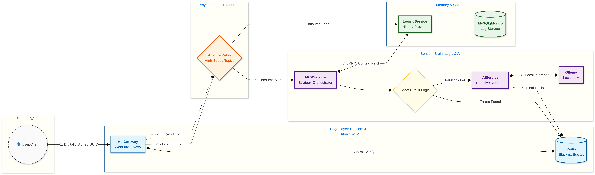
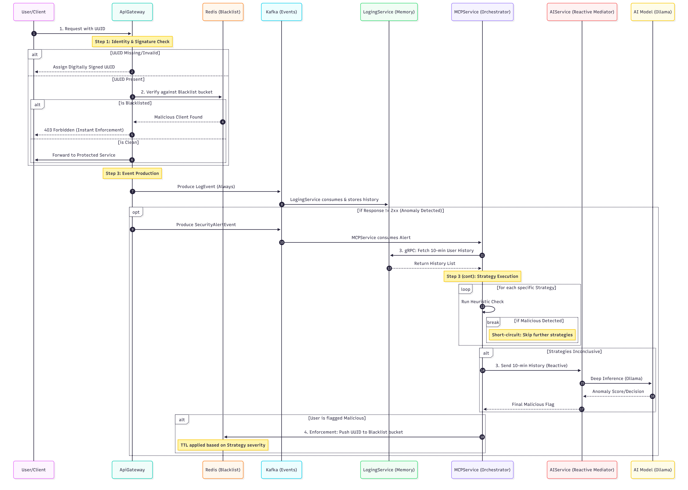

# 🛡️ SentientGate: AI-Driven Distributed Security Mesh

**SentientGate** is an intelligent, high-concurrency security infrastructure designed to protect microservices from sophisticated bot attacks, injection attempts, and behavioral anomalies.

Unlike traditional firewalls that rely on static rules, SentientGate uses a **"Sentient" MCP (Master Control Program)** to analyze user intent in real-time using behavioral history and local LLM inference.

---

# 🏗️ System Architecture

## 📌 High-Level Architecture Diagram



The architecture follows a distributed, event-driven microservice model where detection, analysis, and enforcement are fully decoupled for scalability and resilience.

---

# 🔄 Request Lifecycle (Sequence Flow)

## 📌 Sequence Diagram



This sequence shows how a suspicious request flows through:

1. ApiGateway  
2. Kafka Event Bus  
3. MCPService  
4. LoggingService (via gRPC)  
5. AIService (LLM inference)  
6. Redis TTL enforcement  

---

# 🏗️ Core Services Architecture

The system is composed of multiple specialized services:

---

## 🔹 ApiGateway
- Entry point of the system
- Handles Visitor Identity signing
- Performs high-speed **Blacklist Enforcement**
- Uses **Reactive Redis** for sub-millisecond checks
- Publishes `SecurityAlertEvent` to Kafka

---

## 🔹 MCPService (Sentient Service)
- The brain of the system
- Consumes security alerts from **Kafka**
- Fetches 10-minute behavioral history via **gRPC**
- Executes a **Strategy-based analysis engine**
- Applies TTL-based dynamic blocking

---

## 🔹 AIService
- Reactive Spring Boot service
- Interfaces with local **Ollama LLM**
- Performs deep behavioral anomaly detection
- Used only for high-complexity edge cases

---

## 🔹 LoggingService
- The memory of the system
- Records interaction logs
- Provides historical data to MCP via **gRPC**
- Enables entropy & pattern-based behavioral scoring

---

## 🔹 EurekaServer
- Service discovery for dynamic microservice communication

---

## 🔹 DummyService
- Protected target service used for demonstrating the security mesh

---

# 🚀 Key Features & Innovations

## 🧠 Sentient Analysis Engine

Implemented using the **Strategy Design Pattern**, MCP applies layered defense:

### 1️⃣ Rule-Based Detection
- SQL Injection
- XSS
- Path Traversal
- Pattern-based scanning  
- (`PatternMatchStrategy`)

### 2️⃣ Heuristic Detection
- Burst traffic detection
- High error-rate scanning
- Automated bot probing behavior  
- (`BurstTrafficStrategy`)

### 3️⃣ AI-Driven Detection
- Behavioral entropy analysis
- Local LLM inference using **Ollama**
- Identifies non-human activity patterns
- (`AiAnomalyStrategy`)

---

# ⚡ High-Performance Tech Stack

## Event-Driven Security
- **Apache Kafka**
- Non-blocking threat reporting
- Decoupled detection pipeline
- Fault-tolerant via event persistence

## Reactive Programming
- **Spring WebFlux**
- **Reactive Redis**
- Backpressure-enabled architecture

## Internal Communication
- **gRPC** for low-latency service-to-service communication
- **OpenFeign** for REST-based interactions

## Local AI Inference
- **Ollama**
- Privacy-focused
- Zero external API dependency
- Cost-free LLM processing

---

# 🔐 Security Design Decisions

- TTL-based temporary blocking to prevent permanent false positives
- Kafka-backed event buffering to avoid system collapse
- Decoupled AI inference to avoid Gateway latency increase
- Strategy Pattern for modular threat extension
- Horizontal scalability via stateless service design

---

# 🛠️ Technology Stack

| Layer | Technology |
|-------|------------|
| Backend | Java 21, Spring Boot 3.x |
| Cloud | Spring Cloud, Eureka |
| Messaging | Apache Kafka |
| Communication | gRPC, OpenFeign |
| Databases | Redis (Reactive), MySQL, MongoDB |
| AI | Ollama (Local LLM) |
| Infrastructure | Docker |

---

# 🧪 Installation & Setup

## 1️⃣ Prerequisites

- Java 21
- Maven
- Docker
- Apache Kafka
- Redis
- Ollama

## 2️⃣ Start Ollama

```bash
ollama serve
ollama pull llama3
```

## 3️⃣ Build the Project

```bash
mvn clean install
```

## 4️⃣ Start Services (Order Matters)

1. EurekaServer  
2. LoggingService  
3. AIService  
4. MCPService  
5. ApiGateway  
6. DummyService  

---

# 🏆 Highlights

- Fully asynchronous event-driven security mesh
- Local AI inference (no external API dependency)
- Sub-millisecond blacklist checks
- Strategy pattern–based modular detection engine
- Horizontally scalable microservice design

---

# 👨‍💻 Author

**Shrihari Kulkarni**  
Computer Engineering Student  
Specializing in:
- Computer Networking (OSI / TCP-IP)
- Distributed Systems
- AI-Integrated Security Architectures
- High-Concurrency Microservices Design

---

# 📜 License

This project is licensed under the **Apache License 2.0**.

You are free to use, modify, and distribute this software in accordance with the terms of the license.

See the [LICENSE](LICENSE) file for full details.
```bash
ollama serve
ollama pull llama3
