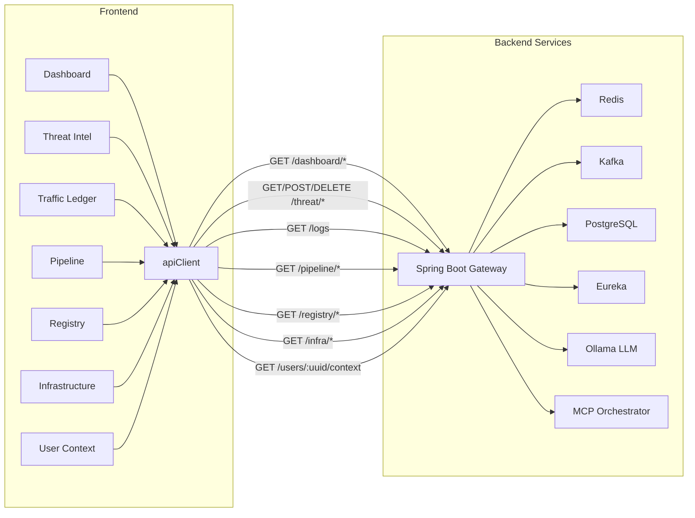

# SentientGate — API Redesign Document

> Complete reference for every HTTP endpoint consumed by the SentientGate Sentinel Overwatch frontend.
> Base URL: `http://localhost:8079/api` (configurable via `VITE_API_BASE_URL`)

---

## Global Configuration

### HTTP Client

| Setting | Value |
|---------|-------|
| Base URL | `VITE_API_BASE_URL` or `http://localhost:8079/api` |
| Timeout | `10 000 ms` |
| Content-Type | `application/json` |
| Auth | `Bearer {JWT}` via `localStorage.sg_token` |
| 401 Handling | Auto-redirect to `/login` |

**Source:** `src/shared/api/client.ts`

---

## API Endpoint Index

| # | Method | Endpoint | Feature | Polling | Source Hook |
|---|--------|----------|---------|---------|-------------|
| 1 | `GET` | `/dashboard/metrics` | Dashboard | 3 s | `useDashboardMetrics` |
| 2 | `GET` | `/dashboard/traffic` | Dashboard | 5 s | `useDashboardMetrics` |
| 3 | `GET` | `/dashboard/threat-dist` | Dashboard | 5 s | `useDashboardMetrics` |
| 4 | `GET` | `/dashboard/recent-blocks` | Dashboard | 3 s | `useDashboardMetrics` |
| 5 | `GET` | `/threat/stats` | Threat Intel | 10 s | `useThreatIntel` |
| 6 | `GET` | `/threat/strategies` | Threat Intel | 5 s | `useThreatIntel` |
| 7 | `POST` | `/threat/strategies/:id/toggle` | Threat Intel | — | `useThreatIntel` |
| 8 | `GET` | `/threat/feed` | Threat Intel | 2 s | `useThreatIntel` |
| 9 | `GET` | `/threat/blacklist` | Threat Intel | 5 s | `useThreatIntel` |
| 10 | `DELETE` | `/threat/blacklist/:uuid` | Threat Intel | — | `useThreatIntel` |
| 11 | `GET` | `/logs` | Traffic Ledger | 2 s (live) | `useLogs` |
| 12 | `GET` | `/pipeline/stats` | Pipeline | 5 s | `usePipeline` |
| 13 | `GET` | `/pipeline/events` | Pipeline | 2 s | `usePipeline` |
| 14 | `GET` | `/registry/services` | Service Registry | 10 s | `useEurekaServices` |
| 15 | `GET` | `/registry/services/:id` | Service Registry | on-demand | `useEurekaInstances` |
| 16 | `GET` | `/registry/actuator/:id/health` | Service Registry | on-demand | `useActuatorHealth` |
| 17 | `GET` | `/infra/kafka` | Infrastructure | 5 s | `useInfraHealth` |
| 18 | `GET` | `/infra/redis` | Infrastructure | 5 s | `useInfraHealth` |
| 19 | `GET` | `/infra/postgres` | Infrastructure | 5 s | `useInfraHealth` |
| 20 | `GET` | `/users/:uuid/context` | User Context Drawer | on-demand | `useUserContext` |

**Total: 20 endpoints (16 GET, 2 POST, 1 DELETE, 1 dynamic GET)**

---

## 1. Dashboard Feature

**Source:** `src/features/dashboard/hooks/useDashboardMetrics.ts`

---

### 1.1 `GET /dashboard/metrics`

> Live KPI counters shown in the top row of the Dashboard.

| Property | Detail |
|----------|--------|
| Polling | Every **3 s** |
| Query Key | `['dashboard', 'metrics']` |

**Request:** No parameters.

**Response: `DashboardMetrics`**

```typescript
interface DashboardMetrics {
  requestsPerMin: number;   // e.g. 3420
  blockedThreats: number;   // e.g. 17
  p99Latency: string;       // e.g. "52.3" (milliseconds)
  activeServices: number;   // e.g. 14
}
```

**Example Response:**
```json
{
  "requestsPerMin": 3420,
  "blockedThreats": 17,
  "p99Latency": "52.3",
  "activeServices": 14
}
```

---

### 1.2 `GET /dashboard/traffic`

> Area chart data showing traffic volume vs threat vectors over the last 20 minutes.

| Property | Detail |
|----------|--------|
| Polling | Every **5 s** |
| Query Key | `['dashboard', 'traffic']` |

**Request:** No parameters.

**Response: `TrafficData[]`**

```typescript
interface TrafficData {
  timestamp: string;     // e.g. "14:23" — human-readable bucket label
  coreFlow: number;      // total requests in bucket
  threatVectors: number; // flagged requests in bucket
}
```

**Example Response:**
```json
[
  { "timestamp": "14:21", "coreFlow": 820, "threatVectors": 42 },
  { "timestamp": "14:22", "coreFlow": 910, "threatVectors": 31 }
]
```

---

### 1.3 `GET /dashboard/threat-dist`

> Pie / bar chart data showing threat type distribution.

| Property | Detail |
|----------|--------|
| Polling | Every **5 s** |
| Query Key | `['dashboard', 'threat-dist']` |

**Request:** No parameters.

**Response: `ThreatDist[]`**

```typescript
interface ThreatDist {
  type: string;   // Strategy or category name
  count: number;  // Number of fires
}
```

**Example Response:**
```json
[
  { "type": "Rate Anomaly", "count": 120 },
  { "type": "Pattern Repeat", "count": 85 },
  { "type": "Suspicious Access", "count": 45 },
  { "type": "AI Escalation", "count": 12 }
]
```

---

### 1.4 `GET /dashboard/recent-blocks`

> Feed of recently blacklisted UUIDs with TTL countdown.

| Property | Detail |
|----------|--------|
| Polling | Every **3 s** |
| Query Key | `['dashboard', 'recent-blocks']` |

**Request:** No parameters.

**Response: `RecentBlock[]`**

```typescript
interface RecentBlock {
  uuid: string;        // Target user identity
  reason: string;      // e.g. "AI_ESCALATION", "RATE_ANOMALY"
  blockedAt: string;   // ISO 8601 timestamp
  ttlSeconds: number;  // Remaining seconds before auto-unblock
}
```

**Example Response:**
```json
[
  {
    "uuid": "a1b2c3d4e5f6",
    "reason": "AI_ESCALATION",
    "blockedAt": "2026-04-10T12:00:00.000Z",
    "ttlSeconds": 300
  }
]
```

---

## 2. Threat Intel Feature

**Source:** `src/features/threat/hooks/useThreatIntel.ts`

---

### 2.1 `GET /threat/stats`

> Global threat statistics banner.

| Property | Detail |
|----------|--------|
| Polling | Every **10 s** |
| Query Key | `['threat', 'stats']` |

**Request:** No parameters.

**Response: `ThreatStats`**

```typescript
interface ThreatStats {
  blockedToday: number;      // e.g. 342
  aiEscalations: number;     // e.g. 12
  avgAnomalyScore: number;   // 0.0 – 1.0, e.g. 0.23
  strategiesActive: number;  // e.g. 4
}
```

---

### 2.2 `GET /threat/strategies`

> List of MCP detection strategies with enable/disable state.

| Property | Detail |
|----------|--------|
| Polling | Every **5 s** |
| Query Key | `['threat', 'strategies']` |

**Request:** No parameters.

**Response: `Strategy[]`**

```typescript
interface Strategy {
  id: string;           // Unique strategy identifier
  name: string;         // e.g. "RateAnomalyStrategy"
  description: string;  // Human-readable purpose
  enabled: boolean;     // Whether currently active
  lastFired: string;    // e.g. "2m ago", "Never"
  firesToday: number;   // Fire count for current day
}
```

**Example Response:**
```json
[
  {
    "id": "1",
    "name": "RateAnomalyStrategy",
    "description": "Detects high volume burst requests",
    "enabled": true,
    "lastFired": "2m ago",
    "firesToday": 142
  },
  {
    "id": "3",
    "name": "JwtTamperStrategy",
    "description": "Detects signature manipulation attempts",
    "enabled": false,
    "lastFired": "Never",
    "firesToday": 0
  }
]
```

---

### 2.3 `POST /threat/strategies/:id/toggle`

> Toggle a strategy's enabled state.

| Property | Detail |
|----------|--------|
| Polling | — (user action) |
| Side Effect | Refetches `['threat', 'strategies']` |

**Request:**

| Param | Location | Type | Description |
|-------|----------|------|-------------|
| `id` | URL path | `string` | Strategy ID |

**Request Body:** None.

**Response:**
```typescript
{ success: boolean }
```

---

### 2.4 `GET /threat/feed`

> Real-time anomaly event stream — the core live ticker.

| Property | Detail |
|----------|--------|
| Polling | Every **2 s** |
| Query Key | `['threat', 'feed']` |

**Request:** No parameters.

**Response: `AnomalyEvent[]`**

```typescript
interface AnomalyEvent {
  uuid: string;                                     // Target identity
  timestamp: string;                                // ISO 8601
  source: 'HEURISTIC' | 'AI_MODEL';                // Detection origin
  strategyFired?: string;                           // Strategy name (if HEURISTIC)
  anomalyScore: number;                             // 0.0 – 1.0
  decision: 'BLACKLISTED' | 'ALLOWED' | 'MONITORING';
  context?: string;                                 // Optional context data
  reasoningText?: string;                           // LLM reasoning (if AI_MODEL)
}
```

**Example Response:**
```json
[
  {
    "uuid": "u-8a7b6c5d4e3f20",
    "timestamp": "2026-04-10T12:15:00.000Z",
    "source": "AI_MODEL",
    "anomalyScore": 0.91,
    "decision": "BLACKLISTED",
    "reasoningText": "LLM flagged rapid switching of Authorization headers across IP range."
  },
  {
    "uuid": "u-8a7b6c5d4e3f21",
    "timestamp": "2026-04-10T12:14:45.000Z",
    "source": "HEURISTIC",
    "strategyFired": "RateAnomalyStrategy",
    "anomalyScore": 0.62,
    "decision": "MONITORING"
  }
]
```

---

### 2.5 `GET /threat/blacklist`

> Currently active blacklist records.

| Property | Detail |
|----------|--------|
| Polling | Every **5 s** |
| Query Key | `['threat', 'blacklist']` |

**Request:** No parameters.

**Response: `BlacklistEntry[]`**

```typescript
interface BlacklistEntry {
  uuid: string;        // Blocked identity
  reason: string;      // e.g. "AI_ESCALATION", "RateAnomalyStrategy"
  blockedAt: string;   // ISO 8601
  ttlSeconds: number;  // Seconds remaining before auto-unblock
}
```

---

### 2.6 `DELETE /threat/blacklist/:uuid`

> Manually unblock a blacklisted identity.

| Property | Detail |
|----------|--------|
| Polling | — (user action) |
| Side Effect | Refetches `['threat', 'blacklist']` |

**Request:**

| Param | Location | Type | Description |
|-------|----------|------|-------------|
| `uuid` | URL path | `string` | Target UUID to unblock |

**Request Body:** None.

**Response:**
```typescript
{ success: boolean }
```

---

## 3. Traffic Ledger Feature

**Source:** `src/features/logs/hooks/useLogs.ts`

---

### 3.1 `GET /logs`

> Paginated audit trail of all gateway-processed requests.

| Property | Detail |
|----------|--------|
| Polling | Every **2 s** (when live mode ON); one-shot otherwise |
| Query Key | `['logs', pathFilter, statusFilter, uuidFilter]` |

**Request — Query Parameters:**

| Param | Type | Required | Description |
|-------|------|----------|-------------|
| `path` | `string` | No | Filter by endpoint path (e.g. `/api/v1/users`) |
| `status` | `string` | No | Filter by status bucket: `2xx`, `4xx`, `5xx` |
| `uuid` | `string` | No | Filter by user identity UUID |
| `page` | `number` | No | Page index (0-based), default `0` |
| `size` | `number` | No | Page size, default `50` |

**Response: `PaginatedLogs`**

```typescript
interface LogEntry {
  id: string;                          // Unique request ID
  timestamp: string;                   // ISO 8601
  uuid: string;                        // User identity
  method: string;                      // HTTP method: GET, POST, DELETE, etc.
  endpoint: string;                    // Request path
  status: number;                      // HTTP status code
  latency: number;                     // Response time in ms
  routeId: string;                     // Gateway route identifier
  threatFlagged: boolean;              // Whether flagged by threat engine
  headers?: Record<string, string>;    // Optional request headers
  kafkaEventId?: string;               // Linked Kafka event ID
  threatDetails?: any;                 // Optional threat metadata
  blacklistStatus?: any;               // Optional blacklist context
}

interface PaginatedLogs {
  content: LogEntry[];
  totalElements: number;
  totalPages: number;
}
```

**Example Response:**
```json
{
  "content": [
    {
      "id": "req-1712750100000-0",
      "timestamp": "2026-04-10T12:15:00.000Z",
      "uuid": "u-user472xyz",
      "method": "POST",
      "endpoint": "/api/v1/auth/login",
      "status": 403,
      "latency": 234,
      "routeId": "route-3",
      "threatFlagged": true
    }
  ],
  "totalElements": 50,
  "totalPages": 1
}
```

---

## 4. Execution Pipeline Feature

**Source:** `src/features/pipeline/hooks/usePipeline.ts`

---

### 4.1 `GET /pipeline/stats`

> Per-stage health and throughput of the gateway filter chain.

| Property | Detail |
|----------|--------|
| Polling | Every **5 s** |
| Query Key | `['pipeline', 'stats']` |

**Request:** No parameters.

**Response: `PipelineStage[]`**

```typescript
interface PipelineStage {
  stage: string;                      // Stage name (matches UI node)
  requestsToday: number;             // Total requests processed at this stage
  status: 'UP' | 'DOWN' | 'DEGRADED';
  lastError: string | null;          // Description of last error, if any
}
```

**Stage Names (ordered):**

| Stage | Description |
|-------|-------------|
| `Request In` | Ingestion & Rate Limit Init |
| `Edge Fire` | Redis Blacklist evaluation |
| `JTI Vault` | JWT tampering detection |
| `Rate Pulse` | Distributed token bucket |
| `Shadow Log` | Kafka async emit |
| `Response Out` | Proxy to microservices |

**Example Response:**
```json
[
  { "stage": "Request In", "requestsToday": 145023, "status": "UP", "lastError": null },
  { "stage": "Edge Fire", "requestsToday": 145023, "status": "DOWN", "lastError": "Redis connection timeout" },
  { "stage": "JTI Vault", "requestsToday": 144900, "status": "UP", "lastError": null },
  { "stage": "Rate Pulse", "requestsToday": 142000, "status": "UP", "lastError": null },
  { "stage": "Shadow Log", "requestsToday": 139000, "status": "UP", "lastError": null },
  { "stage": "Response Out", "requestsToday": 139000, "status": "UP", "lastError": null }
]
```

---

### 4.2 `GET /pipeline/events`

> Live event ticker showing individual requests flowing through the pipeline.

| Property | Detail |
|----------|--------|
| Polling | Every **2 s** |
| Query Key | `['pipeline', 'events']` |

**Request:** No parameters.

**Response: `PipelineEvent[]`**

```typescript
interface PipelineEvent {
  id: string;               // Unique event ID
  timestamp: string;        // ISO 8601
  uuid: string;             // User identity
  status: 'PASSED' | 'BLOCKED';
  stage: string;            // Stage where blocked, or "Response Out" if passed
}
```

---

## 5. Service Registry Feature

**Source:** `src/features/registry/hooks/useEurekaServices.ts`

---

### 5.1 `GET /registry/services`

> List of all registered microservices from Eureka.

| Property | Detail |
|----------|--------|
| Polling | Every **10 s** |
| Query Key | `['registry', 'services']` |

**Request:** No parameters.

**Response: `EurekaService[]`**

```typescript
interface EurekaService {
  id: string;             // Service identifier
  name: string;           // Display name
  instanceCount: number;  // Running instances
  status: 'UP' | 'DOWN' | 'STARTING';
}
```

**Example Response:**
```json
[
  { "id": "sentient-gateway", "name": "sentient-gateway", "instanceCount": 3, "status": "UP" },
  { "id": "payment-service", "name": "payment-service", "instanceCount": 4, "status": "DOWN" }
]
```

---

### 5.2 `GET /registry/services/:id`

> Instance-level detail for a specific service (triggered on selection).

| Property | Detail |
|----------|--------|
| Polling | On-demand (no auto-polling) |
| Query Key | `['registry', 'instances', serviceId]` |

**Request:**

| Param | Location | Type | Description |
|-------|----------|------|-------------|
| `id` | URL path | `string` | Service ID |

**Response: `EurekaInstance[]`**

```typescript
interface EurekaInstance {
  host: string;           // e.g. "10.0.1.5"
  port: number;           // e.g. 8080
  status: string;         // "UP" or "DOWN"
  homepage: string;       // e.g. "http://10.0.1.5:8080"
  lastHeartbeat: string;  // ISO 8601
}
```

---

### 5.3 `GET /registry/actuator/:id/health`

> Spring Boot Actuator health for a service.

| Property | Detail |
|----------|--------|
| Polling | On-demand |
| Query Key | `['registry', 'actuator', serviceId]` |

**Request:**

| Param | Location | Type | Description |
|-------|----------|------|-------------|
| `id` | URL path | `string` | Service ID |

**Response: `ActuatorHealth`**

```typescript
interface ActuatorHealth {
  status: string;                  // "UP" | "DOWN"
  components: {
    [key: string]: {               // e.g. "db", "redis"
      status: string;
      details?: Record<string, any>;  // e.g. { database: "PostgreSQL" }
    };
  };
}
```

**Example Response:**
```json
{
  "status": "UP",
  "components": {
    "db": { "status": "UP", "details": { "database": "PostgreSQL" } },
    "redis": { "status": "UP" }
  }
}
```

---

## 6. Infrastructure Feature

**Source:** `src/features/infra/hooks/useInfraHealth.ts`

---

### 6.1 `GET /infra/kafka`

> Kafka broker / topic health and audit log tail.

| Property | Detail |
|----------|--------|
| Polling | Every **5 s** |
| Query Key | `['infra', 'kafka']` |

**Request:** No parameters.

**Response: `KafkaHealth`**

```typescript
interface KafkaTopic {
  name: string;         // e.g. "security-audit-events"
  partitions: number;   // e.g. 12
  lag: number;          // Consumer lag
  throughput: number;   // Messages/sec
}

interface KafkaHealth {
  status: 'UP' | 'DOWN';
  topics: KafkaTopic[];
  recentAudit: string[];  // Last N audit log entries
}
```

**Example Response:**
```json
{
  "status": "UP",
  "topics": [
    { "name": "security-audit-events", "partitions": 12, "lag": 45, "throughput": 1240 },
    { "name": "gateway-metrics", "partitions": 6, "lag": 0, "throughput": 850 }
  ],
  "recentAudit": [
    "[Event-K0] Threat signature detected on Edge Fire. UUID=u-0xyz",
    "[Event-K1] Threat signature detected on Edge Fire. UUID=u-1xyz"
  ]
}
```

---

### 6.2 `GET /infra/redis`

> Redis cache health, memory usage, and hit ratio.

| Property | Detail |
|----------|--------|
| Polling | Every **5 s** |
| Query Key | `['infra', 'redis']` |

**Request:** No parameters.

**Response: `RedisHealth`**

```typescript
interface RedisHealth {
  status: 'UP' | 'DOWN';
  latency: number;          // Ping latency in ms (e.g. 4.2)
  memoryUsed: string;       // e.g. "2.4 GB"
  memoryMax: string;        // e.g. "4.0 GB"
  blacklistKeys: number;    // Active blacklist entries in Redis
  tokenBuckets: number;     // Active rate-limit buckets
  hitRatio: number;         // 0.0 – 1.0 (e.g. 0.94)
}
```

---

### 6.3 `GET /infra/postgres`

> PostgreSQL connection pool and identity record stats.

| Property | Detail |
|----------|--------|
| Polling | Every **5 s** |
| Query Key | `['infra', 'postgres']` |

**Request:** No parameters.

**Response: `PostgresHealth`**

```typescript
interface PostgresHealth {
  status: 'UP' | 'DOWN';
  activeConnections: number;      // Currently in-use
  idleConnections: number;        // Idle pool connections
  maxConnections: number;         // Pool max capacity
  totalIdentityRecords: number;   // Total records in identity table
  lastWrite: string;              // ISO 8601 timestamp of last write
}
```

---

## 7. User Context Drawer

**Source:** `src/features/threat/components/UserContextDrawer.tsx`

---

### 7.1 `GET /users/:uuid/context`

> Deep-dive identity assessment — triggered when clicking any `CopyableUUID` component.

| Property | Detail |
|----------|--------|
| Polling | On-demand (no auto-polling) |
| Query Key | `['users', uuid, 'context']` |

**Request:**

| Param | Location | Type | Description |
|-------|----------|------|-------------|
| `uuid` | URL path | `string` | Target user identity UUID |

**Response: `UserContext`**

```typescript
interface TimelinePoint {
  timestamp: string;     // ISO 8601
  requestCount: number;  // Requests in this time bucket
}

interface RequestTrace {
  timestamp: string;     // ISO 8601
  method: string;        // HTTP method
  endpoint: string;      // Request path
  status: number;        // HTTP status code
  threat: boolean;       // Whether flagged
}

interface AnomalyScore {
  timestamp: string;     // Label
  score: number;         // 0.0 – 1.0
}

interface AIProfile {
  lastAssessment: string;          // LLM-generated security summary
  anomalyScores: AnomalyScore[];   // Anomaly score trajectory
}

interface UserContext {
  uuid: string;
  status: 'ALLOWED' | 'MONITORING' | 'BLACKLISTED';
  timeline: TimelinePoint[];               // 10-minute request histogram
  recentRequests: RequestTrace[];           // Last N requests
  activeStrategies: string[];              // Names of strategies flagging this user
  blacklistInfo: BlacklistEntry | null;    // Null if not blacklisted
  aiProfile: AIProfile;                    // LLM assessment & anomaly chart
}
```

**Example Response:**
```json
{
  "uuid": "u-8a7b6c5d4e3f20",
  "status": "MONITORING",
  "timeline": [
    { "timestamp": "2026-04-10T12:05:00.000Z", "requestCount": 23 },
    { "timestamp": "2026-04-10T12:05:30.000Z", "requestCount": 41 }
  ],
  "recentRequests": [
    {
      "timestamp": "2026-04-10T12:15:00.000Z",
      "method": "GET",
      "endpoint": "/api/v1/auth/verify",
      "status": 403,
      "threat": true
    }
  ],
  "activeStrategies": ["RateAnomalyStrategy", "PatternRepeatStrategy"],
  "blacklistInfo": null,
  "aiProfile": {
    "lastAssessment": "User behavior indicates rapid, sequential token validations typical of credential stuffing attacks.",
    "anomalyScores": [
      { "timestamp": "t-0", "score": 0.72 },
      { "timestamp": "t-1", "score": 0.88 }
    ]
  }
}
```

---

## Architecture Diagram



---

## Polling Strategy Summary

| Feature | Endpoint | Interval | Method |
|---------|----------|----------|--------|
| Dashboard | `/dashboard/metrics` | 3 s | `usePolling` |
| Dashboard | `/dashboard/traffic` | 5 s | `usePolling` |
| Dashboard | `/dashboard/threat-dist` | 5 s | `usePolling` |
| Dashboard | `/dashboard/recent-blocks` | 3 s | `usePolling` |
| Threat Intel | `/threat/stats` | 10 s | `usePolling` |
| Threat Intel | `/threat/strategies` | 5 s | `usePolling` |
| Threat Intel | `/threat/feed` | 2 s | `usePolling` |
| Threat Intel | `/threat/blacklist` | 5 s | `usePolling` |
| Logs | `/logs` | 2 s (live) | `usePolling` |
| Pipeline | `/pipeline/stats` | 5 s | `usePolling` |
| Pipeline | `/pipeline/events` | 2 s | `usePolling` |
| Registry | `/registry/services` | 10 s | `usePolling` |
| Registry | `/registry/services/:id` | on-demand | `useQuery` |
| Registry | `/registry/actuator/:id/health` | on-demand | `useQuery` |
| Infra | `/infra/kafka` | 5 s | `useQuery` + `refetchInterval` |
| Infra | `/infra/redis` | 5 s | `useQuery` + `refetchInterval` |
| Infra | `/infra/postgres` | 5 s | `useQuery` + `refetchInterval` |
| User Context | `/users/:uuid/context` | on-demand | `useQuery` |

---

## Status Enums Reference

| Enum | Values | Used In |
|------|--------|---------|
| `StatusType` | `BLOCKED`, `ALLOWED`, `MONITORING`, `UP`, `DOWN`, `DEGRADED`, `STARTING`, `BLACKLISTED` | `StatusBadge` component |
| `AnomalyDecision` | `BLACKLISTED`, `ALLOWED`, `MONITORING` | Threat Feed |
| `AnomalySource` | `HEURISTIC`, `AI_MODEL` | Threat Feed |
| `PipelineStageStatus` | `UP`, `DOWN`, `DEGRADED` | Pipeline |
| `ServiceStatus` | `UP`, `DOWN`, `STARTING` | Registry |
| `EventStatus` | `PASSED`, `BLOCKED` | Pipeline Events |

---

> **Note:** All endpoints are currently mocked by MSW handlers (`src/mocks/handlers.ts`) in development.
> When the Spring Boot backend is ready, the same contracts should be implemented on the server side to ensure zero frontend changes.
